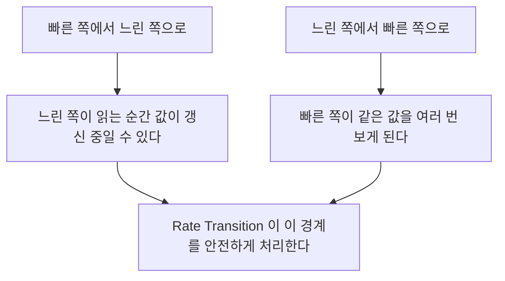

> **기준 출처:** [MathWorks What Is Sample Time](https://www.mathworks.com/help/simulink/ug/what-is-sample-time.html) · Types of Sample Time과 Sample Time Colors와 Solver Selection · Rate Transition과 Zero-Order Hold와 Sample Time Math 레퍼런스 / 확인일 2026-08-07
> **시리즈:** [목차](/posts/00-mp-series/) | 이전 → [08. 계층구조와 조건부 실행](/posts/08-hierarchy-conditional-execution/) | 다음 → [Stateflow 01. Chart 구성 요소](/posts/01-sf-chart-elements/)

## 1. 이 글의 범위

언제 계산이 일어나는가를 다룬다. 실시간 제어 코드에서는 값이 맞는 것만으로 충분하지 않고 정해진 주기에 정해진 순서로 계산되어야 한다. 그 주기를 정하는 것이 샘플 시간이고 시간을 진행시키는 방식을 정하는 것이 솔버다.

## 2. 샘플 시간의 표기

블록마다 Sample time 파라미터가 있고 다음 값을 가질 수 있다.

| 값 | 이름 | 의미 |
| --- | --- | --- |
| `0` | 연속 | 솔버가 정하는 시점마다 계산한다 |
| 양수 Ts | 이산 | Ts초마다 계산한다 |
| `[Ts, offset]` | 오프셋 있는 이산 | offset만큼 늦춰서 Ts 주기로 계산한다 |
| `-1` | 상속 | 입력이나 상위 계층에서 받아온다 |
| `inf` | 상수 | 변하지 않으므로 한 번만 계산한다 |

대부분의 블록은 `-1`로 두어 상속시킨다. 그러면 모델의 주기를 한 곳에서 정할 수 있고 주기를 바꿀 때 블록을 하나씩 고치지 않아도 된다. 단점은 추적이 어렵다는 것이다. 어떤 신호의 실제 주기를 알려면 컴파일 후에 확인해야 한다.

```matlab
get_param(blk, 'CompiledSampleTime')     % 컴파일된 상태에서만 유효하다
```

모델 화면에서 샘플 시간 색상 표시를 켜면 주기별로 선의 색이 달라져 한눈에 구별된다.

## 3. 다중 레이트 모델

하나의 모델 안에 서로 다른 주기가 섞이는 것을 다중 레이트라고 한다. 제어 루프는 1 ms, 통신 처리는 4 ms, 상태 감시는 10 ms로 도는 구성이 그 예다.

모든 것을 가장 빠른 주기로 돌리면 CPU 부하가 불필요하게 커진다. 실제로 빨라야 하는 부분만 빠르게 두고 나머지는 느리게 두는 것이 표준적인 설계다.

서로 다른 주기 사이에서 데이터를 주고받을 때 문제가 생긴다.



Rate Transition 블록의 파라미터는 두 개다.

| 파라미터 | 의미 |
| --- | --- |
| Ensure data integrity during data transfer | 값이 반쯤 갱신된 상태로 읽히지 않게 한다 |
| Ensure deterministic data transfer | 전달 지연을 일정하게 고정한다 |

결정론 옵션이 중요하다. 켜면 지연이 항상 같아 동작이 재현되지만 최대 한 주기의 추가 지연이 생긴다. 끄면 지연이 줄지만 실행 타이밍에 따라 값이 달라질 수 있다. 안전 관련 로직에서는 재현성을 택하는 것이 일반적이다.

Rate Transition을 넣지 않으면 Simulink가 오류나 경고를 내거나 설정에 따라 자동으로 삽입한다.


_위는 Rate Transition으로 1 ms로 들어온 신호를 4 ms 쪽으로 넘긴다. 블록 아이콘의 위아래 화살표와 두 개의 빗살 무늬가 서로 다른 두 주기를 잇는다는 표시다. 아래는 Zero-Order Hold이고 아이콘의 계단 모양이 샘플링한 값을 다음 샘플까지 유지한다는 뜻이다. 두 블록 모두 그림만으로는 주기 값을 알 수 없고 Sample time 파라미터를 확인해야 한다._

Zero-Order Hold는 빠른 신호를 지정한 주기로 샘플링하고 다음 샘플까지 그 값을 유지한다. Rate Transition과 목적이 겹치는 부분이 있으나 Zero-Order Hold는 샘플링 자체를 표현하고 Rate Transition은 전달의 안전성을 다룬다.

## 4. Sample Time Math

샘플 시간을 계산에 직접 사용하는 블록이다.

일반적으로 주기를 곱하거나 나누는 적분이나 미분이나 속도 환산 계산에는 주기 값을 Constant로 두고 Product를 쓴다. 그런데 이 방식은 주기를 바꿀 때 Constant 값도 함께 고쳐야 한다. 고치지 않으면 모델은 정상으로 보이는데 계산만 틀린다.

Sample Time Math 블록은 신호의 샘플 시간을 자동으로 가져와 연산에 사용한다.

| 파라미터 | 의미 |
| --- | --- |
| Operation | 사칙연산과 Ts Only와 1/Ts Only 등 |
| Weight value | 샘플 시간에 곱할 가중치 |

주기가 바뀌어도 자동으로 따라가므로 주기 변경에 대해 안전하다. 다만 샘플 시간이 상속으로 정해지므로 어떤 값이 실제로 쓰이는지 컴파일 후에 확인해야 한다.

## 5. 솔버

Configuration Parameters의 Solver 탭에서 정한다.

| | 고정 스텝 | 가변 스텝 |
| --- | --- | --- |
| 시간 진행 | 항상 같은 간격이다 | 정확도에 따라 간격을 조정한다 |
| 실행 시간 | 예측 가능하다 | 예측할 수 없다 |
| 코드 생성 | 가능하다 | 불가하다 |
| 용도 | 임베디드 제어와 실시간 | 해석과 플랜트 시뮬레이션 |

생성 코드를 만들 목적이면 고정 스텝이어야 한다. 실시간 시스템은 정해진 주기에 정해진 시간 안에 끝나야 하므로 스텝 간격이 변하는 것을 허용할 수 없다.

모델에 연속 상태가 없으면 솔버를 discrete로 둘 수 있고 이것이 제어 로직 모델의 일반적인 설정이다. 미분방정식을 풀 필요가 없으므로 가장 단순하고 빠르다.

고정 스텝 모델의 기본 스텝 크기는 모델 안 모든 샘플 시간의 최대공약수로 정해진다. 1 ms와 4 ms와 10 ms가 섞여 있으면 기본 스텝은 1 ms이고 4 ms 작업은 4 스텝마다, 10 ms 작업은 10 스텝마다 실행된다.

주기 하나를 3.5 ms 같은 어중간한 값으로 두면 최대공약수가 아주 작아져 기본 스텝이 불필요하게 촘촘해진다. 주기는 서로 정수배 관계가 되도록 정하는 것이 원칙이다.

## 6. 실시간 관점에서의 확인 항목

| 항목 | 확인 방법 |
| --- | --- |
| 모델의 기본 주기 | 최상위 샘플 시간과 고정 스텝 크기 |
| 다중 레이트 여부 | 샘플 시간 색상 표시 |
| 레이트 경계 처리 | Rate Transition 존재 여부와 결정론 옵션 |
| 상속으로 정해진 실제 주기 | 컴파일 후 `CompiledSampleTime` |
| 주기 간 정수배 관계 | 샘플 시간 목록을 나열해 최대공약수를 확인한다 |
| 솔버 | 고정 스텝인가, 이산 전용인가 |

## 정리

- 샘플 시간은 연속과 이산과 오프셋 있는 이산과 상속과 상수 중 하나다.
- `-1` 상속이 일반적이지만 실제 주기는 컴파일 후에만 확정된다.
- 서로 다른 주기 사이에는 Rate Transition을 둔다. 결정론 옵션이 재현성과 지연을 맞바꾼다.
- Sample Time Math는 주기를 자동으로 가져오므로 주기 변경에 안전하다.
- 코드 생성에는 고정 스텝 솔버가 필요하다.
- 제어 로직 모델은 대개 이산 전용 솔버로 둔다.
- 여러 주기는 정수배 관계가 되도록 정한다. 그렇지 않으면 기본 스텝이 과도하게 작아진다.

## 확인 문제

1. 샘플 시간 `-1`의 의미와 그 단점을 쓰라.
2. Rate Transition의 결정론 옵션을 켜는 것과 끄는 것의 장단점을 쓰라.
3. 생성 코드를 만들 모델에서 가변 스텝 솔버를 쓸 수 없는 이유를 설명하라.
4. 모델 안의 주기가 1 ms와 4 ms와 3.5 ms일 때 기본 스텝은 얼마가 되며 어떤 문제가 생기는가.

## 참고

- [MathWorks — What Is Sample Time?](https://www.mathworks.com/help/simulink/ug/what-is-sample-time.html)
- MathWorks Simulink — Rate Transition, Zero-Order Hold, Sample Time Math 레퍼런스