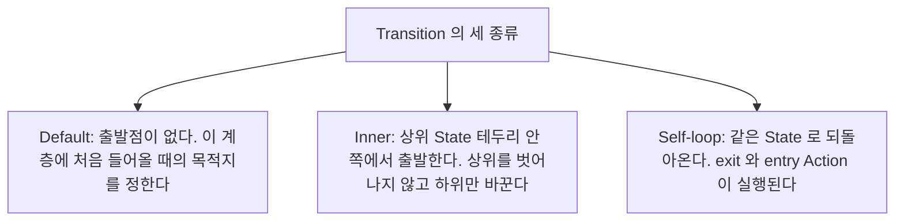
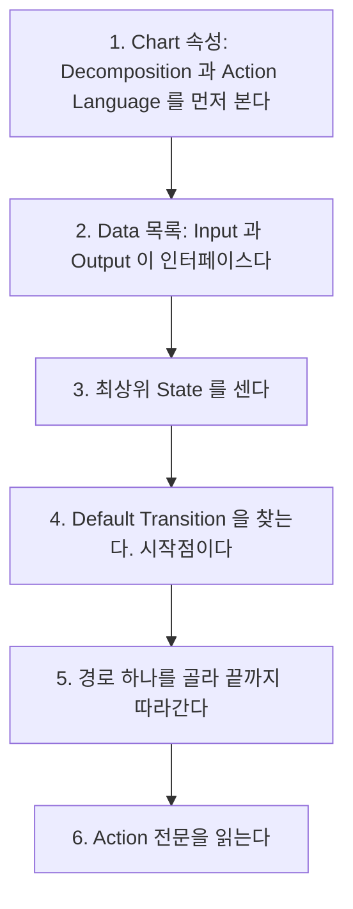

> **기준 출처:** [MathWorks Stateflow Chart Concepts](https://www.mathworks.com/help/stateflow/gs/finite-state-machines.html) · States와 Transitions와 Junctions와 Hierarchy 문서 · Stateflow User's Guide의 Model Finite State Machines / 확인일 2026-08-07
> **시리즈:** [목차](/posts/00-mp-series/) | 이전 → [Simulink 09. 샘플 시간과 솔버](/posts/09-sample-time-solver/) | 다음 → [02. Chart 속성](/posts/02-sf-chart-properties/)

대상은 Stateflow 차트를 처음 보는 독자다. 예제는 모두 이 글에서 새로 만든 것이고, Stateflow 객체 이름은 영어 원어를 쓴다.

## 1. Stateflow는 무엇인가

Simulink가 계산의 흐름을 표현한다면 Stateflow는 상황에 따라 달라지는 동작을 표현한다.

Simulink 블록 다이어그램으로 지금 시스템이 어떤 국면에 있는가를 표현하려면 플래그 신호와 Switch를 겹겹이 쌓아야 하고 국면이 늘어날수록 읽기 어려워진다. Stateflow는 그 국면을 State라는 도형으로 직접 그리고 국면 사이의 이동을 Transition이라는 화살표로 그린다.

Stateflow Chart는 Simulink 모델 안에 하나의 블록으로 놓인다. 입력 포트로 신호를 받고 출력 포트로 신호를 내보내며 실행 시점은 Simulink의 샘플 시간에 따라 정해진다.

## 2. 다섯 가지 요소

| 요소 | 그림 | 무엇인가 |
| --- | --- | --- |
| State | 모서리가 둥근 사각형 | 시스템이 머무를 수 있는 국면 |
| Transition | 화살표 | State 사이의 이동 |
| Junction | 작은 원 | 화살표가 갈라지거나 모이는 지점 |
| Data | 그림이 없다 | Chart가 다루는 변수 |
| Event | 그림이 없다 | 실행을 촉발하는 신호 |

Data와 Event는 캔버스에 그려지지 않고 Symbols 창이나 Model Explorer에서 관리한다. 차트를 읽을 때 그림만 보면 절반만 본 것이다.


_한 그림에 요소가 모여 있다. 모서리가 둥근 상자 세 개가 State이고, 왼쪽 위의 점에서 시작하는 화살표가 Default Transition이며 출발 State가 없다. State 사이의 화살표가 Transition이고 라벨의 대괄호 안이 조건이다. 가운데의 작은 원이 Junction인데 State가 아니라서 여기 머무르지 않고 지나갈 뿐이다. Junction에서 나가는 두 갈래에 붙은 번호가 평가 순서다. 두 번째 갈래에 조건이 없다는 점이 중요하다. 조건 없는 기본 갈래가 없으면 두 조건이 다 거짓일 때 경로가 State에 도달하지 못해 이동 자체가 취소된다._

## 3. State

State는 시스템이 머무르는 하나의 국면이고 어느 시점에나 활성이거나 비활성이다. State 안에는 이름과 Action이 적힌다.

```text
+-------------------------+
| Idle                    |   <- 이름
| entry: out = 0;         |   <- Action
| during: cnt = cnt + 1;  |
+-------------------------+
```

Action의 종류와 실행 시점은 [03편](/posts/03-sf-state-action/)에서 다룬다.

State 안에 다른 State를 넣을 수 있고 안쪽을 하위 State, 바깥을 상위 State라고 한다. 계층은 두 가지 이점이 있다. 공통 조건을 한 번만 쓸 수 있어서 어떤 하위 상태에 있든 오류가 나면 정지한다를 상위에서 나가는 Transition 하나로 표현할 수 있고, 읽는 단위가 줄어들어 상위 수준에서 큰 흐름을 보고 필요할 때만 안으로 들어갈 수 있다.

하위 State는 상위 State가 활성일 때만 활성이 될 수 있다.

한 State 안에 여러 하위 State가 있을 때 그들이 어떤 관계인지를 정하는 것이 Decomposition이다.

| 설정 | 관계 | 그림 |
| --- | --- | --- |
| `EXCLUSIVE_OR` | 하나만 활성이다 | 실선 테두리 |
| `PARALLEL_AND` | 전부 동시에 활성이다 | 점선 테두리 |

이 구분이 차트를 읽는 데 결정적이라 [02편](/posts/02-sf-chart-properties/)에서 따로 다룬다.

## 4. Transition

State에서 State로 가는 화살표다. 화살표 옆에 붙은 라벨이 언제 이동하고 무엇을 하는지를 정한다. 라벨의 문법은 [04편](/posts/04-sf-transition-labels/)에서 다룬다.



Default Transition은 출발점이 없는 화살표이고 위쪽에 점이 찍힌 화살표로 그려진다. EXCLUSIVE_OR 계층에는 반드시 필요하다. 없으면 어느 State를 활성화할지 정할 수 없어 실행 시 오류가 발생한다.

Inner Transition은 상위 State의 테두리 안쪽에서 출발하는 화살표다. 상위 State를 벗어나지 않으면서 하위 State를 바꾸고, 바깥으로 나가는 Transition과 구별되며 실행 순서에서도 다르게 취급된다.

Self-loop Transition은 같은 State로 되돌아오는 화살표다. State를 나갔다가 다시 들어오므로 exit Action과 entry Action이 실행된다. 상태는 그대로인데 초기화 동작만 반복하고 싶을 때 쓴다.

## 5. Junction

Connective Junction은 작은 원으로 그려지고 Transition을 갈라지게 하거나 모으는 지점이다.

Junction 자체는 상태가 아니다. 시스템이 Junction에 머무르지 않으며 한 실행 안에서 통과할 뿐이다. Junction을 지나는 경로는 끝까지 유효한 State에 도달해야 하고 도달하지 못하면 이동이 일어나지 않는다.

용도가 둘이다. 조건 분기로 쓰면 하나의 출발점에서 조건에 따라 여러 목적지로 나눌 수 있고, 이때 나가는 Transition들의 평가 순서가 결과를 결정하며 순서는 화살표에 붙은 번호로 표시된다. 공통 경로 묶기로 쓰면 여러 State에서 같은 조건으로 같은 곳에 갈 때 화살표를 Junction으로 모아 라벨을 한 번만 쓸 수 있다.

History Junction은 원 안에 H가 그려진 표시다. 상위 State를 다시 활성화할 때 마지막으로 활성이었던 하위 State로 복귀하게 한다. 없으면 Default Transition이 가리키는 State로 돌아간다.

| | History Junction이 있으면 | 없으면 |
| --- | --- | --- |
| 재진입 시 | 나갈 때의 하위 State로 간다 | Default Transition의 목적지로 간다 |
| 쓰는 곳 | 일시 중단 후 재개 | 항상 처음부터 시작 |

## 6. Data

Chart 안에서 쓰는 변수다. 캔버스에 그려지지 않고 Symbols 창에서 관리한다.

| 속성 | 의미 |
| --- | --- |
| Scope | 어디서 오고 어디로 가는가. Input과 Output과 Local과 Parameter와 Constant 등 |
| Type | 데이터 타입으로 `uint16`이나 `single`이나 `boolean` 등 |
| Size | 스칼라인가 배열인가 |
| Initial value | 초기값 |

Scope가 Input이면 Chart 블록에 입력 포트가 생기고 Output이면 출력 포트가 생긴다. Data 목록이 곧 Chart의 인터페이스다. [05편](/posts/05-sf-data-scope-type/)에서 다룬다.

## 7. Event

실행을 촉발하는 신호다. Data와 마찬가지로 그림에 나타나지 않는다. 입력 Event는 바깥에서 들어와 Chart를 깨우고, 로컬 Event는 Chart 안에서 `send`로 발생시켜 다른 부분을 촉발한다. Transition 라벨의 맨 앞에 Event 이름을 적으면 그 Event가 발생했을 때만 그 Transition이 평가된다.

Event를 쓰지 않고 조건만으로 구성한 Chart도 많다. 그 경우 Chart는 샘플 시간마다 주기적으로 깨어나고, 이것이 제어 로직에서 더 일반적인 구성이다. Event 기반 구조는 실행 시점이 데이터에 따라 달라져 실시간 분석이 복잡해지기 때문이다.

## 8. 차트를 처음 읽는 순서



1번의 두 항목을 모르면 나머지를 오독한다. 5번에서 모든 화살표를 동시에 보지 않는 것이 중요하다.

두 Chart의 State 수와 Transition 수가 같다는 이유로 동일하다고 판단하면 안 된다. Action 전문을 대조한 뒤에만 같다고 쓸 수 있다. 마찬가지로 이것뿐이다나 없다 같은 표현은 전수 조회 후에만 쓴다.

## 정리

- Stateflow는 국면과 이동으로 동작을 표현하고 Simulink 안에 블록으로 놓인다.
- 구성 요소는 State와 Transition과 Junction과 Data와 Event 다섯이고 Data와 Event는 그림에 없다.
- State는 계층을 가지며 형제 관계는 Decomposition이 정한다.
- Default Transition은 진입점이고 EXCLUSIVE_OR 계층에 반드시 필요하다.
- Junction은 State가 아니다. 경로는 끝까지 State에 도달해야 이동이 성립한다.
- History Junction은 마지막 하위 State로 복귀시킨다.
- Data의 Scope가 Chart 블록의 포트를 만든다. Data 목록이 곧 인터페이스다.

## 확인 문제

1. Junction이 State가 아니라는 것은 실행 관점에서 무엇을 뜻하는가.
2. Default Transition이 없는 EXCLUSIVE_OR 계층에서 어떤 문제가 생기는가.
3. History Junction이 있을 때와 없을 때 재진입 동작의 차이를 쓰라.
4. 두 Chart가 같다고 쓰기 위해 필요한 확인 절차는 무엇인가.

## 참고

- [MathWorks — Stateflow Chart Concepts](https://www.mathworks.com/help/stateflow/gs/finite-state-machines.html)
- MathWorks Stateflow — States, Transitions, Junctions, Hierarchy