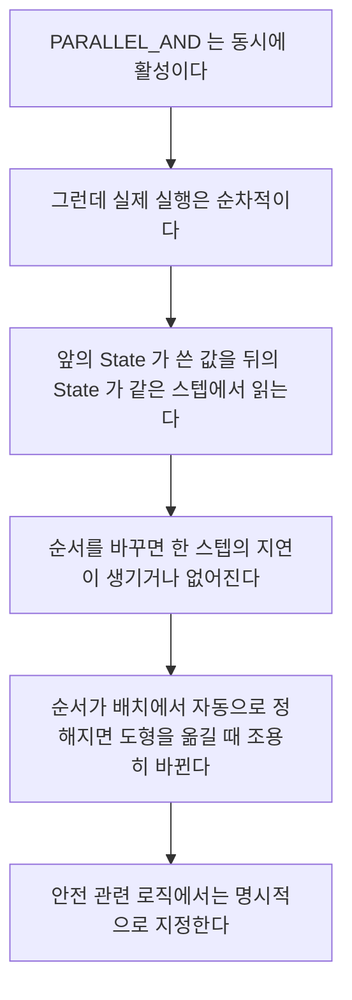

> **기준 출처:** [MathWorks Specify Properties for Stateflow Charts](https://www.mathworks.com/help/stateflow/ug/setting-properties-for-individual-charts.html) · Differences Between MATLAB and C as Action Language · Parallel and Exclusive State Decomposition · Execution of a Chart at Initialization / 확인일 2026-08-07
> **시리즈:** [목차](/posts/00-mp-series/) | 이전 → [01. Chart 구성 요소](/posts/01-sf-chart-elements/) | 다음 → [03. State와 Action](/posts/03-sf-state-action/)

## 1. 왜 속성을 먼저 보는가

Chart 속성은 캔버스에 거의 드러나지 않으면서 Chart 전체의 해석을 바꾼다. Decomposition 하나만 달라도 하나만 활성과 전부 활성으로 정반대가 되고, Action Language가 달라지면 같은 문자열이 다른 문법이 된다.

Chart를 읽는 첫 단계는 그림을 보는 것이 아니라 속성을 확인하는 것이다. 마우스 오른쪽 클릭 후 Properties에서 보거나 명령으로 조회한다.

```matlab
ch = find(sfroot, '-isa', 'Stateflow.Chart', 'Name', '<차트이름>');
ch.StateMachineType     % Decomposition 관련
ch.ActionLanguage
ch.ChartUpdate
ch.ExecuteAtInitialization
```

## 2. Decomposition

가장 중요한 속성이고 같은 계층에 있는 State들의 관계를 정한다.

| 값 | 의미 | 테두리 |
| --- | --- | --- |
| `EXCLUSIVE_OR` | 형제 State 중 하나만 활성이다 | 실선 |
| `PARALLEL_AND` | 형제 State가 전부 동시에 활성이다 | 점선 |

`EXCLUSIVE_OR`은 일반적으로 떠올리는 FSM이다. 시스템은 한 번에 하나의 국면에만 있고, Default Transition이 필요하며 어느 시점에나 활성 State는 정확히 하나다.


_테두리가 실선이고 이것이 `EXCLUSIVE_OR`의 표시다. 두 State 중 하나만 활성이며 각각의 조건으로 서로 오간다._

`PARALLEL_AND`는 형제 State들이 동시에 전부 활성이다. 서로 독립적인 관심사를 나란히 두는 구조이고 각자 안에 자기만의 하위 State를 가진다.


_테두리가 점선이고 앞 그림의 실선과 비교하면 차이가 한눈에 드러난다. 각 State의 오른쪽 위에 붙은 흐린 숫자가 실행 순서다. 동시에 활성이지만 실제 실행은 이 번호 순서대로 하나씩 진행된다. 이 번호는 기본적으로 화면 배치에서 자동으로 정해지므로 도형을 옮기면 번호가 바뀔 수 있고, 그러면 같은 스텝 안에서 값이 전달되는 방향이 달라진다._

병렬 State의 성질이 셋이다.



Chart 속성의 실행 순서 사용자 지정 옵션을 켜면 번호를 직접 정할 수 있다. 켜지 않으면 Stateflow가 배치를 근거로 정하고, 다이어그램을 정리하다가 순서가 조용히 바뀐다.

Decomposition은 Chart 전체에 하나만 있는 것이 아니라 각 State마다 그 하위 계층에 대해 정해진다. 최상위는 `PARALLEL_AND`이고 그 안의 각 State는 `EXCLUSIVE_OR`인 구성이 흔하다.

## 3. Action Language

Chart 안에 적는 코드의 문법을 정한다.

| | `MATLAB` | `C` |
| --- | --- | --- |
| 같지 않다 | `~=` | `!=` |
| 부정 | `~` | `!` |
| 배열 인덱스 | `a(1)`이고 1-기반이다 | `a[0]`이고 0-기반이다 |
| 논리 AND와 OR | `&&`와 `\|\|` | `&&`와 `\|\|` |
| 행렬 연산 | 지원한다 | 제한적이다 |
| 주석 | `%` | `/* */`와 `//` |
| 증감 연산자 | 없다 | `++`와 `--`를 쓸 수 있다 |

`MATLAB`이 최신 릴리스의 기본값이고 MATLAB 언어와 같은 문법을 쓰므로 [MATLAB 05편](/posts/05-operators-logical/)의 내용이 그대로 적용된다.

같은 문자열이 두 언어에서 다르게 해석되는 경우가 있다. 특히 배열 인덱스 기준이 다르므로 `C`로 작성된 오래된 차트를 읽을 때 인덱스를 그대로 옮기면 한 칸씩 어긋난다. Chart를 읽기 전에 `ch.ActionLanguage`를 반드시 확인한다.

## 4. ChartUpdate

Chart가 실행되는 시점을 정한다.

| 값 | 의미 |
| --- | --- |
| `INHERITED` | 입력 신호의 샘플 시간을 따른다. 기본값이다 |
| `DISCRETE` | 지정한 주기마다 실행한다 |
| `CONTINUOUS` | 연속 시간이고 솔버가 정하는 시점마다 실행한다 |

`INHERITED`는 편리하지만 실제 주기가 상위 문맥에 달려 있어 Chart만 봐서는 알 수 없다. `DISCRETE`로 명시하면 주기가 Chart 자체에 기록된다.

시간 연산자를 절대 시간 단위로 쓰려면 Chart가 이산이어야 한다. [06편](/posts/06-sf-temporal-operators/)에서 다룬다.

`CONTINUOUS`는 연속 시간 동역학을 Chart 안에서 다룰 때 쓴다. 제어 로직 Chart에서는 거의 쓰지 않고 코드 생성 대상에서도 제약이 많다.

`ChartUpdate`가 `DISCRETE`일 때 SampleTime으로 주기를 지정하고 `-1`이면 상속이다.

## 5. ExecuteAtInitialization

모델 초기화 시점에 Default Transition을 실행할 것인가를 정한다.

| 값 | 동작 |
| --- | --- |
| `false`, 기본값 | 첫 번째 실행 시점에 Default Transition이 실행된다 |
| `true` | 모델 초기화 단계에서 Default Transition과 entry Action이 실행된다 |

`true`로 두면 출력 Data가 초기화 단계에서 이미 갱신된다. Chart의 출력을 읽는 다른 블록이 첫 스텝에서 초기값이 아닌 실제 값을 본다는 뜻이다.

`false`이면 첫 스텝에서 출력이 Data의 초기값으로 남아 있을 수 있고, 그 값이 하위 로직으로 흘러가 한 스텝 동안 의도하지 않은 동작을 만들 수 있다. 기동 순간의 동작이 중요한 시스템에서 이 속성을 `true`로 두는 이유가 여기 있다.

다만 `true`로 두면 entry Action이 초기화 시점에 한 번 더 실행되는 셈이므로 entry Action에 카운터 증가나 Event 발생 같은 부작용이 있는 경우 동작이 달라진다. 속성을 바꿀 때는 entry Action 전체를 함께 검토한다.

## 6. StatesWhenEnabling

Chart가 조건부 실행 서브시스템 안에 있을 때 다시 활성화되는 순간의 State 처리를 정한다.

| 값 | 동작 |
| --- | --- |
| `held` | 비활성이 되기 직전의 State를 그대로 유지한다 |
| `reset` | Default Transition부터 다시 시작한다 |
| `inherit` | 상위 서브시스템의 설정을 따른다 |

Simulink의 Enabled Subsystem 파라미터와 같은 개념이다. [Simulink 08편](/posts/08-hierarchy-conditional-execution/)에서 다뤘다. Chart가 조건부 서브시스템 안에 있지 않다면 이 속성은 동작에 영향을 주지 않는다.

## 7. 그 밖의 속성

| 속성 | 의미 |
| --- | --- |
| 실행 순서 사용자 지정 | 실행 순서를 사람이 지정할 것인가 |
| Enable C-bit operations | C Action Language에서 비트 연산자 사용을 허용한다 |
| Support variable-size arrays | 가변 크기 배열을 지원한다. 코드 생성에 제약이 따른다 |
| Saturate on integer overflow | 정수 오버플로 시 포화 여부를 정한다 |
| Initialize outputs every time chart wakes up | 깨어날 때마다 출력을 초기값으로 되돌릴 것인가 |
| Export chart level functions | Chart 안의 그래픽 함수를 바깥에서 호출 가능하게 한다 |

Saturate on integer overflow는 Chart 안의 산술이 포화할지 순환할지를 정하므로 정수 연산이 많은 Chart에서는 반드시 확인한다.

## 8. 읽기 전 확인 목록

| 항목 | 왜 필요한가 |
| --- | --- |
| Decomposition | 하나만 활성인가 전부 활성인가 |
| Action Language | `~=`인가 `!=`인가, 인덱스 기준은 무엇인가 |
| ChartUpdate | 언제 깨어나는가 |
| SampleTime | 시간 연산자의 기준이 된다 |
| 실행 순서 사용자 지정 | 배치에 의존하는가 |
| ExecuteAtInitialization | 첫 스텝의 출력이 무엇인가 |
| StatesWhenEnabling | 재활성화 시 리셋되는가 |
| Saturate on integer overflow | 포화인가 순환인가 |

## 정리

- Chart 속성은 캔버스에 드러나지 않으면서 Chart 전체의 해석을 바꾼다. 그림보다 먼저 본다.
- `EXCLUSIVE_OR`은 하나만 활성이고 `PARALLEL_AND`는 전부 활성이다. 계층마다 따로 정해진다.
- 병렬 State도 실제 실행은 순차적이고 순서가 결과를 바꾼다. 배치에 의존하지 말고 명시 지정한다.
- Action Language가 `MATLAB`이면 `~=`와 1-기반 인덱스이고 `C`면 `!=`와 0-기반 인덱스다.
- `ExecuteAtInitialization`이 `true`면 초기화 단계에서 Default Transition과 entry Action이 실행된다.
- `StatesWhenEnabling`은 조건부 서브시스템 안에서만 의미가 있다.
- 정수 연산이 많은 Chart에서는 오버플로 포화 설정을 확인한다.

## 확인 문제

1. `PARALLEL_AND` 계층에서 동시에 활성인데도 실행 순서를 지정해야 하는 이유를 쓰라.
2. 실행 순서를 사용자 지정하지 않으면 어떤 상황에서 순서가 바뀔 수 있는가.
3. `ExecuteAtInitialization`이 `false`일 때 첫 스텝에서 어떤 문제가 생길 수 있는가.
4. Action Language를 확인하지 않고 차트를 읽으면 어떤 오독이 발생하는가. 두 가지를 쓰라.

## 참고

- [MathWorks — Specify Properties for Stateflow Charts](https://www.mathworks.com/help/stateflow/ug/setting-properties-for-individual-charts.html)
- MathWorks Stateflow — Differences Between MATLAB and C as Action Language