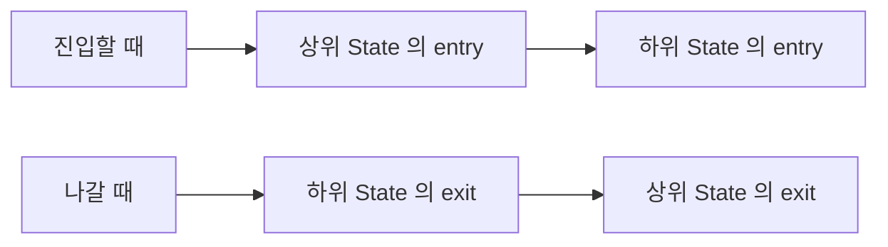

> **기준 출처:** [MathWorks State Actions](https://www.mathworks.com/help/stateflow/ug/state-action-types.html) · Execution Order for Parallel States와 Chart Execution Semantics · Stateflow User's Guide의 Define Actions in a Chart / 확인일 2026-08-07
> **시리즈:** [목차](/posts/00-mp-series/) | 이전 → [02. Chart 속성](/posts/02-sf-chart-properties/) | 다음 → [04. Transition 읽는 법](/posts/04-sf-transition-labels/)

## 1. Action이란

State 안에 적는 코드다. 언제 실행되는가를 앞에 붙인 키워드가 정한다.

```text
+----------------------------------+
| Heating                          |
| entry: heater = 1;               |
| during: elapsed = elapsed + dt;  |
| exit:  heater = 0;               |
+----------------------------------+
```

키워드 없이 코드만 적으면 `during`으로 해석된다. 의도를 분명히 하기 위해 항상 키워드를 명시하는 편이 낫다.


_실제 Stateflow 화면이다. State 상자 안에 이름과 Action이 함께 들어가고 첫 줄이 이름이며 그 아래가 Action이다. `entry:`는 들어올 때 한 번, `during:`은 활성인 동안 매번, `exit:`는 나갈 때 한 번 실행된다. `entry` 아래에 들여쓴 둘째 줄처럼 하나의 키워드 아래에 여러 문장을 이어 쓸 수 있다. 왼쪽 위의 점에서 시작하는 화살표가 Default Transition이다._

## 2. 세 가지 기본 Action

| 키워드 | 축약 | 실행 시점 |
| --- | --- | --- |
| `entry` | `en` | State에 들어올 때 한 번 |
| `during` | `du` | State가 활성인 동안 매 실행마다 |
| `exit` | `ex` | State를 나갈 때 한 번 |

`entry`는 State에 진입하는 순간 한 번 실행되고 그 국면에서의 초기 설정을 담는다. 진입할 때마다 실행되므로 같은 State에 여러 번 들어오면 여러 번 실행된다.

`during`은 State가 활성인 동안 Chart가 깨어날 때마다 실행되고 그 국면에서 계속 해야 하는 일을 담는다. 단 나가는 Transition이 성립하면 `during`은 실행되지 않는다. 실행 순서상 나가는 Transition 평가가 먼저이기 때문이다.

`exit`는 State를 벗어나는 순간 한 번 실행되고 뒷정리를 담는다. `exit`를 쓰는 이유는 나가는 경로가 여러 개일 때 정리 코드를 한 곳에만 쓰기 위해서다. 각 Transition의 Action에 같은 코드를 반복해서 쓰면 하나를 빠뜨렸을 때 드러나지 않는다.

## 3. 그 밖의 Action

| 키워드 | 실행 시점 |
| --- | --- |
| `on <이벤트>` | 그 Event가 발생했고 State가 활성일 때 |
| `on after(n, sec)` | State 진입 후 n초가 지났을 때 |
| `on every(n, sec)` | State 진입 후 n초마다 반복한다 |
| `bind` | 이 State만 특정 Data를 쓸 수 있도록 결합한다 |

`on after`와 `on every`는 시간 연산자와 함께 쓴다. [06편](/posts/06-sf-temporal-operators/)에서 다룬다.

`bind`는 지정한 Data를 이 State와 그 하위에서만 쓸 수 있게 제한한다. 다른 State가 그 Data를 바꾸는 것을 막아 소유권을 명확히 하고, 병렬 State들이 공유 변수를 통해 간섭하는 것을 방지할 때 쓴다.

## 4. State 계층에서의 Action 실행

계층이 있으면 상위와 하위의 Action이 함께 실행되고 순서가 정해져 있다.



진입은 바깥에서 안으로, 이탈은 안에서 바깥으로 간다. 자원을 잡고 놓는 순서와 같다고 보면 기억하기 쉽다.

## 5. 한 번의 실행에서 일어나는 일

Chart가 깨어나면 활성인 State마다 다음 순서로 진행한다.

```text
1) 나가는(outer) Transition 을 평가한다
     -> 성립하면 이동하고 이 State 의 처리는 끝난다. during 은 실행되지 않는다
2) 이동이 없으면 during Action 을 실행한다
3) inner Transition 을 평가한다
4) 활성인 하위 State 로 내려가서 1)부터 반복한다
```

그리고 Chart는 잠든다. 이 순서가 만드는 결과가 셋이다.

나가는 조건이 성립하는 스텝에서는 `during`이 실행되지 않는다. `during`에 카운터 증가를 넣었다면 마지막 한 번이 빠진다.

상위가 먼저이고 하위가 나중이다. 상위의 나가는 Transition이 성립하면 하위는 아예 실행되지 않으므로, 상위에서 나가는 Transition 하나로 하위 전체를 중단시킬 수 있다.

한 스텝에 여러 번 이동할 수 있다. 4번에서 하위로 내려가 다시 평가하므로 계층이 깊으면 한 실행 안에서 여러 계층의 이동이 연쇄적으로 일어난다.

## 6. Action을 쓸 때의 주의

| | `entry` | `during` |
| --- | --- | --- |
| 성격 | 한 번만 해야 하는 일 | 계속 해야 하는 일 |
| 예 | 카운터 초기화, 출력 초기 설정 | 카운터 증가, 값 갱신 |

초기화를 `during`에 넣으면 매 스텝 초기화되어 아무 일도 일어나지 않는다. 반대로 누적을 `entry`에 넣으면 한 번만 실행된다. 증상이 값이 안 변한다거나 값이 한 번만 변한다로 나타난다.

같은 State로 돌아오는 Self-loop Transition은 나갔다가 다시 들어오는 것이므로 `exit`와 `entry`가 모두 실행된다. 상태는 그대로인데 초기화만 하고 싶다는 요구를 이것으로 표현한다. 단 Inner Transition으로 자기 자신을 가리키면 `exit`와 `entry`가 실행되지 않는다. 둘의 차이가 미묘하므로 의도를 문서에 남긴다.

출력을 `during`에서만 갱신하면 나가는 Transition이 성립한 스텝에서는 갱신되지 않는다. 이 스텝에서 출력이 한 스텝 전 값으로 남는 것이 문제가 된다면 Transition Action이나 `exit`에서 명시적으로 설정해야 한다.

`send`로 Event를 발생시키거나 Data Store에 쓰는 Action은 실행 횟수가 곧 부작용의 횟수다. `entry`와 `during`과 `exit` 중 어디에 두느냐에 따라 발생 횟수가 달라지므로 신중히 정한다.

## 7. Action 문법

Action Language가 `MATLAB`인 경우 본문은 MATLAB 표현식과 같다.

```text
entry: out = uint16(0);
       flag = false;

during: if in_val > threshold
            cnt = cnt + uint16(1);
        else
            cnt = uint16(0);
        end
```

문장 끝의 세미콜론은 출력 억제 용도이고 Stateflow에서는 관례적으로 붙인다. 여러 줄을 쓸 수 있고 `if`와 `switch`와 `for`를 쓸 수 있다. Chart 안에 정의한 그래픽 함수나 MATLAB 함수나 Simulink 함수를 부를 수 있다. 타입 규칙은 MATLAB과 같아서 서로 다른 정수 타입을 섞을 수 없다. [MATLAB 03편](/posts/03-cast-overflow-saturation/)에서 다뤘다.

Action은 최종적으로 C 코드로 생성되므로 동적 메모리 할당이나 가변 크기 배열 같은 것은 제약이 있다. 배열 크기는 고정되어야 하고 타입은 컴파일 시점에 확정되어야 한다.

## 정리

- Action은 들어올 때 한 번인 `entry`, 활성인 동안 매번인 `during`, 나갈 때 한 번인 `exit`가 기본이다.
- 키워드를 생략하면 `during`으로 해석된다. 항상 명시한다.
- 계층에서 진입은 바깥에서 안으로, 이탈은 안에서 바깥으로 간다.
- 한 번의 실행은 나가는 Transition, `during`, inner Transition, 하위 State 순서다.
- 나가는 Transition이 성립한 스텝에서는 `during`이 실행되지 않는다.
- 초기화를 `during`에 넣으면 매 스텝 초기화되고 누적을 `entry`에 넣으면 한 번만 실행된다.
- Self-loop는 `exit`와 `entry`를 실행하지만 자기 자신을 가리키는 Inner Transition은 실행하지 않는다.

## 확인 문제

1. `entry`와 `during`과 `exit` 각각에 넣기 적절한 코드의 예를 하나씩 쓰라.
2. 나가는 Transition이 성립한 스텝에서 `during`이 실행되지 않는 것이 왜 문제가 될 수 있는가.
3. 계층 구조에서 상위 State를 나갈 때 하위와 상위의 `exit` Action 중 어느 것이 먼저 실행되는가.
4. Self-loop Transition과 자기 자신을 가리키는 Inner Transition의 차이를 쓰라.

## 참고

- [MathWorks — State Actions](https://www.mathworks.com/help/stateflow/ug/state-action-types.html)
- MathWorks Stateflow — Chart Execution Semantics, Define Actions in a Chart