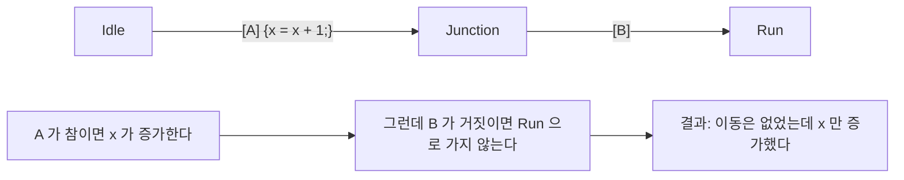

> **기준 출처:** [MathWorks Transitions](https://www.mathworks.com/help/stateflow/ug/transitions.html) · Transition Action Types와 Evaluation Order for Transitions · Connective Junctions와 Default Transitions / 확인일 2026-08-07
> **시리즈:** [목차](/posts/00-mp-series/) | 이전 → [03. State와 Action](/posts/03-sf-state-action/) | 다음 → [05. Data Scope와 타입](/posts/05-sf-data-scope-type/)

## 1. 라벨의 전체 문법

Transition 옆에 붙는 글자는 네 부분으로 이루어지고 네 부분 모두 생략할 수 있다.

```text
event [condition] {condition_action} / transition_action
```

| 부분 | 기호 | 무엇인가 | 언제 실행되나 |
| --- | --- | --- | --- |
| event | 없다 | 이 Event가 발생했을 때만 평가한다 | 해당 없다 |
| condition | 대괄호 | 이동 조건 | 평가만 한다 |
| condition_action | 중괄호 | 조건이 참이 되는 순간 실행한다 | 이동이 확정되지 않아도 실행된다 |
| transition_action | 슬래시 | 이동이 확정된 뒤 실행한다 | 목적지 State로 실제로 갈 때만 |

기호를 보고 어느 부분인지 즉시 판단할 수 있어야 한다. 대괄호는 조건, 중괄호는 조건 액션, 슬래시는 전이 액션이다.


_네 부분 중 세 개가 한 줄에 들어 있는 실제 라벨이다. 대괄호 안이 조건으로 매 평가마다 판정만 하고, 중괄호 안이 조건 액션으로 조건이 참이 되는 즉시 실행되며, 슬래시 뒤가 전이 액션으로 이동이 확정된 뒤 실행된다. 중괄호와 슬래시의 차이가 이 그림의 요점이다. 이동이 취소되어도 중괄호 쪽은 이미 실행돼 있고 슬래시 쪽은 실행되지 않는다._

## 2. 각 부분

라벨 맨 앞에 Event 이름을 적으면 그 Event가 발생했을 때만 이 Transition이 평가된다. Event를 쓰지 않는 Chart에서는 이 부분이 비어 있고 Chart가 깨어날 때마다 조건이 평가된다.

대괄호 안의 condition은 이동할지 판정하는 논리식이다. 문법은 Action Language를 따르므로 `MATLAB`이면 `~=`이고 `C`면 `!=`다. [02편](/posts/02-sf-chart-properties/)에서 다뤘다.

condition은 값을 바꾸지 않아야 한다. 조건식 안에서 대입이나 부작용 있는 함수 호출을 하면 평가 순서에 따라 실행 여부가 달라져 예측하기 어려워진다.

중괄호 안의 condition_action은 조건이 참으로 평가되는 순간 즉시 실행되고 목적지에 실제로 도착하는지와 무관하다. 이것이 중요한 이유는 경로 중간에서 조건이 참이었지만 최종적으로 이동이 성립하지 않는 경우가 있기 때문이다.



Junction을 지나는 경로에서 뒷부분 조건이 거짓이면 이동은 취소되지만 이미 실행된 condition action은 되돌려지지 않는다. 이 성질이 의도치 않은 부작용의 흔한 원인이다. 값을 바꾸는 코드는 가급적 transition action이나 State의 `entry`에 둔다.

슬래시 뒤의 transition_action은 이동이 최종 확정된 뒤 목적지 State의 `entry`보다 먼저 실행된다. 부작용이 있는 코드는 이쪽이 안전하다. 이동하지 않으면 실행되지 않기 때문이다.

| | condition_action | transition_action |
| --- | --- | --- |
| 실행 시점 | 조건이 참이 되는 즉시 | 이동이 확정된 뒤 |
| 이동이 취소되면 | 이미 실행됐다 | 실행되지 않는다 |
| 목적지 `entry`와의 순서 | 먼저다 | 먼저다 |
| 권장 용도 | 조건 평가에 필요한 임시 계산 | 상태 변경에 따른 실제 동작 |

## 3. 평가 순서

한 State에서 나가는 Transition이 여러 개면 순서대로 하나씩 평가하고 처음으로 성립하는 것을 택한다. 각 Transition의 출발점 근처에 붙은 숫자가 평가 순서이고 순서는 세 규칙으로 정해진다. Event를 지정한 Transition이 먼저 평가되고, 그 다음 조건이 있는 것과 마지막으로 조건이 없는 것 순서이며, 같은 등급 안에서는 Chart 속성 설정에 따라 배치 기준이나 사용자 지정 번호로 정해진다.

조건이 겹치는 Transition이 있으면 순서에 따라 결과가 달라진다. 나가는 두 갈래가 각각 `[v > 10]`과 `[v > 5]`일 때 `v`가 20이면 앞 순위가 먼저 성립하므로 그쪽으로 가고, 순서가 반대였다면 다른 쪽으로 간다.

조건이 서로 배타적이지 않은 설계는 순서에 의존한다. 안전 관련 로직에서는 조건을 배타적으로 설계하거나 순서를 명시적으로 지정하고 문서에 남긴다.

Chart 속성의 실행 순서 사용자 지정 옵션을 켜면 번호를 직접 정할 수 있다. 켜지 않으면 배치를 근거로 자동 결정되고 도형을 옮기면 순서가 바뀔 수 있다.

## 4. Junction을 지나는 경로

Junction은 State가 아니므로 시스템이 머무를 수 없다. Junction을 지나는 경로는 끝까지 유효한 State에 도달해야 이동이 성립하고, 도달하지 못하면 그 경로는 취소되고 다음 순위의 Transition을 평가한다.

경로가 막히면 Junction으로 되돌아와 다른 갈래를 시도한다. 이때 이미 실행된 condition action은 취소되지 않는다. 이것이 Junction을 쓸 때 condition action을 조심해야 하는 이유다.

Junction에서 나가는 갈래 중 조건이 없는 것을 하나 두면 다른 조건이 모두 거짓일 때 그쪽으로 간다. 조건 없는 갈래가 없으면 이동이 성립하지 않을 수 있다. 모든 갈래에 조건을 붙이면 어느 것도 성립하지 않는 경우가 생기므로 그때 무슨 일이 일어나는지를 설계가 정해 두어야 한다.

## 5. Transition의 종류

| 종류 | 그림 | 의미 |
| --- | --- | --- |
| 일반 | State에서 State로 | 보통의 이동 |
| Default | 출발점 없는 화살표에 점 표시 | 계층 진입 시의 초기 State |
| Inner | 상위 State 테두리 안쪽에서 출발 | 상위를 벗어나지 않고 하위를 바꾼다 |
| Self-loop | 같은 State로 되돌아온다 | `exit`와 `entry`를 실행한다 |
| Supertransition | 계층을 가로지른다 | 서로 다른 계층의 State를 직접 연결한다 |

Outer Transition은 상위 State를 벗어나므로 상위의 `exit` Action이 실행된다. Inner Transition은 상위 State 안에 머무르므로 상위의 `exit`와 `entry`가 실행되지 않는다. 실행 순서에서도 outer가 먼저이고 inner가 나중이다.

Supertransition은 계층을 가로질러 깊은 곳의 State로 직접 들어가는 화살표다. 편리하지만 계층의 캡슐화를 깨뜨려 읽기 어려워진다. 계층 구조로 표현할 수 있으면 그쪽을 택하는 편이 낫다.

## 6. 라벨 읽기 연습

`[cnt >= limit]{cnt = uint16(0);}/out = uint16(1);`을 해석해 본다.

| 부분 | 내용 | 실행 시점 |
| --- | --- | --- |
| condition | `cnt >= limit` | 매 평가마다 판정한다 |
| condition_action | `cnt = uint16(0);` | 조건이 참이 되는 즉시 |
| transition_action | `out = uint16(1);` | 이동이 확정된 뒤 |

주의할 점이 있다. 이 Transition이 Junction을 거쳐 최종적으로 막히면 `cnt`는 0이 되었는데 `out`은 바뀌지 않고 State도 그대로인 상황이 된다. 이런 조합은 검토 대상이다.

## 7. 자주 발생하는 문제

| 증상 | 원인 |
| --- | --- |
| 이동해야 하는데 안 한다 | 앞 순위의 Transition이 먼저 성립했다. 순서를 확인한다 |
| 이동은 안 했는데 값이 바뀌었다 | condition action이 실행됐다. transition action으로 옮긴다 |
| 도형을 옮겼더니 동작이 바뀌었다 | 실행 순서가 배치에 의존한다. 사용자 지정으로 고정한다 |
| Junction에서 멈춘 것처럼 보인다 | 모든 갈래의 조건이 거짓이라 이동이 성립하지 않았다 |
| 상위를 벗어나야 하는데 안 벗어난다 | Inner Transition을 썼다. Outer로 바꾼다 |
| 조건은 같은데 결과가 다르다 | Action Language 차이를 확인한다 |

## 정리

- 라벨 문법은 event와 조건과 조건 액션과 전이 액션 네 부분이고 모두 생략할 수 있다.
- 대괄호는 조건, 중괄호는 조건 액션, 슬래시는 전이 액션이다.
- 조건 액션은 이동이 취소되어도 되돌려지지 않는다. 부작용은 전이 액션에 둔다.
- 나가는 Transition이 여럿이면 순서대로 평가하고 처음 성립하는 것을 택한다.
- 조건이 배타적이지 않으면 순서가 결과를 바꾼다. 순서를 명시 지정한다.
- Junction을 지나는 경로는 State에 도달해야 성립한다. 조건 없는 기본 갈래를 두는 것이 안전하다.
- Inner Transition은 상위의 `exit`와 `entry`를 실행하지 않는다.

## 확인 문제

1. 중괄호와 슬래시의 실행 시점 차이를 쓰고 부작용 있는 코드를 어디에 두어야 하는지 설명하라.
2. Junction을 거치는 경로에서 이동이 취소되었을 때 이미 실행된 조건 액션은 어떻게 되는가.
3. 나가는 Transition 두 개의 조건이 `[v > 10]`과 `[v > 5]`일 때 순서에 따라 결과가 어떻게 달라지는가.
4. Junction의 모든 갈래에 조건을 붙였을 때 생길 수 있는 문제를 쓰라.

## 참고

- [MathWorks — Transitions](https://www.mathworks.com/help/stateflow/ug/transitions.html)
- MathWorks Stateflow — Transition Action Types, Evaluation Order for Transitions