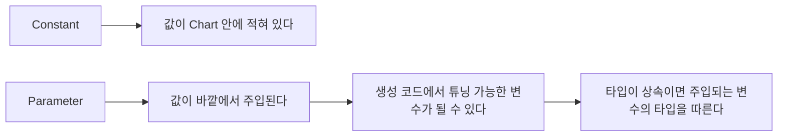

> **기준 출처:** [MathWorks Add Stateflow Data](https://www.mathworks.com/help/stateflow/ug/adding-data.html) · Scope of Stateflow Data와 Set Data Properties · Share Data with Data Store Memory와 Parameters in Charts / 확인일 2026-08-07
> **시리즈:** [목차](/posts/00-mp-series/) | 이전 → [04. Transition 읽는 법](/posts/04-sf-transition-labels/) | 다음 → [06. 시간 연산자](/posts/06-sf-temporal-operators/)

## 1. Data 목록이 곧 인터페이스다

Chart의 Data는 캔버스에 그려지지 않고 Symbols 창이나 Model Explorer에서만 보인다. 그런데 Data의 Scope가 Chart 블록의 입출력 포트를 결정하므로, Data 목록을 보지 않고 Chart를 읽는 것은 함수의 인수 목록을 보지 않고 함수를 읽는 것과 같다.

Chart를 분석할 때는 이름과 Scope와 Type과 Size와 초기값을 담은 표를 먼저 만든다.

## 2. Scope 여섯 가지

| Scope | 의미 | 포트가 생기는가 | 쓰기 가능 |
| --- | --- | --- | --- |
| `Input` | 바깥에서 받는 값 | 입력 포트가 생긴다 | 읽기만 된다 |
| `Output` | 바깥으로 내보내는 값 | 출력 포트가 생긴다 | 읽기와 쓰기가 된다 |
| `Local` | Chart 안에서만 쓰는 변수 | 생기지 않는다 | 읽기와 쓰기가 된다 |
| `Constant` | 변하지 않는 값 | 생기지 않는다 | 읽기만 된다 |
| `Parameter` | 바깥에서 오는 조정값 | 생기지 않는다 | 읽기만 된다 |
| `Data Store Memory` | Simulink의 전역 저장소에 연결한다 | 생기지 않는다 | 읽기와 쓰기가 된다 |

`Input`과 `Output`이 Chart의 계약이다. 이름과 순서가 Chart 블록의 포트 순서를 정한다. `Input`은 Action에서 대입할 수 없고 시도하면 오류가 발생한다. `Output`은 스텝마다 갱신되며 갱신하지 않으면 이전 값이 유지되는데, Chart 속성에서 깨어날 때마다 출력을 초기화하는 옵션을 켜면 초기값으로 되돌아간다.

`Local`은 Chart 안에서만 쓰는 변수이고 스텝을 넘어 값이 유지된다. Local Data는 Chart의 상태 일부라는 뜻이다. 카운터나 이전 값 저장이나 중간 계산 결과에 쓰고 초기값을 지정하지 않으면 0으로 시작한다. 계층 안에 Local Data를 정의하면 그 계층과 하위에서만 보이므로 소유권을 좁히면 병렬 State 간의 의도치 않은 간섭을 줄일 수 있다.

`Constant`는 값이 고정된다. 마스크 값이나 플래그 정의처럼 코드에 상수를 흩뿌리지 않고 이름을 붙일 때 쓴다.

`Parameter`는 바깥에서 오는 조정 가능한 값이고 출처는 기본이나 모델 워크스페이스의 변수, 데이터 딕셔너리의 `Simulink.Parameter` 객체, 상위 마스크 서브시스템의 마스크 파라미터 중 하나다.



`Parameter`의 Type이 상속으로 되어 있으면 주입되는 변수의 타입을 그대로 따른다. Chart만 봐서는 타입을 알 수 없고 워크스페이스나 딕셔너리를 확인해야 한다.

`Data Store Memory`는 Simulink의 Data Store에 연결한다. Chart 안에서 일반 변수처럼 읽고 쓰지만 실제로는 모델 전역의 저장소를 건드리므로 실행 순서 보장이 없다는 문제가 그대로 적용된다. [Simulink 07편](/posts/07-stateful-blocks-datastore/)에서 다뤘다. Chart 안의 `Local`로 충분한 값을 Data Store로 두면 불필요한 결합이 생기므로 정말로 다른 서브시스템과 공유해야 하는 값에 한정한다.

## 3. 타입

Data의 Type은 MATLAB의 타입 체계를 따른다.

| 설정 | 의미 |
| --- | --- |
| `uint8`과 `uint16`과 `uint32`와 `int8` 등 | 명시적 정수 |
| `single`과 `double` | 부동소수 |
| `boolean` | 논리 |
| 상속 (Same as Simulink) | 연결된 신호나 주입된 변수의 타입을 따른다 |
| `fixdt(...)` | 고정소수점 |
| `Bus: <버스이름>` | 버스, 곧 구조체 |

상속 설정은 편리하지만 Chart 문서만으로는 타입이 확정되지 않는다. 분석 문서에 상속이라고만 적으면 읽는 사람이 실제 타입을 알 수 없다. 실제 타입은 컴파일 후에 확인한다.

```matlab
% 모델을 컴파일한 상태에서 Chart 블록의 포트 타입을 확인한다
get_param(chartBlk, 'CompiledPortDataTypes')
```

인터페이스에 해당하는 Data는 타입을 명시적으로 고정하는 편이 안전하다. 상위 모델을 고쳤을 때 Chart 안의 연산 의미가 조용히 바뀌는 것을 막는다.

Action 안에서의 타입 규칙은 MATLAB과 같다. 서로 다른 정수 타입은 직접 연산할 수 없고 정수와 `single`도 직접 연산할 수 없으며, 정수와 `double` 스칼라는 가능하고 결과는 정수 타입이다. [MATLAB 03편](/posts/03-cast-overflow-saturation/)에서 다뤘다.

임베디드 Chart에서 `uint16`과 `single`이 섞여 있으면 연산할 때마다 명시적 변환이 필요하다. 이것이 Action 코드에 변환 함수가 자주 보이는 이유다.

Chart 속성의 오버플로 포화 설정이 Chart 안 정수 연산의 넘침 처리를 정한다. 켜면 포화이고 끄면 순환이다.

## 4. Size

| 설정 | 의미 |
| --- | --- |
| `-1`이나 비움 | 상속한다. 연결된 신호를 따른다 |
| `1` | 스칼라 |
| `[n]`이나 `[m n]` | 배열 |

배열 Data는 Action에서 인덱스로 접근한다. Action Language가 `MATLAB`이면 1-기반이고 `C`면 0-기반이다.

코드 생성 대상에서는 크기가 컴파일 시점에 고정되어야 한다. 가변 크기 배열은 Chart 속성에서 별도로 허용해야 하고 제약이 따른다.

## 5. Initial value

`Local`과 `Output`과 `Constant`에 초기값을 지정할 수 있다. 지정하지 않으면 0이고, 표현식을 쓸 수 있으며 타입을 맞추려면 `uint16(0)`처럼 감싼다. `Input`에는 초기값이 없다. 바깥에서 오는 값이기 때문이다.

| 상황 | 적용 |
| --- | --- |
| 모델 시작 | 항상 적용된다 |
| Chart가 조건부 서브시스템 안에서 재활성화 | `StatesWhenEnabling`이 `reset`일 때 적용된다 |
| 깨어날 때마다 출력 초기화 옵션이 켜짐 | 깨어날 때마다 적용되고 `Output`에 한한다 |

## 6. Data 목록으로 Chart를 읽는 방법

분석할 때 Data 표를 만들고 다섯 가지를 확인한다. `Input`과 `Output`을 분리해 세면 그것이 Chart의 계약이다. 상속으로 된 항목을 표시하면 타입이 미확정인 항목이 드러난다. `Local` 중 스텝을 넘어 유지되는 값을 찾으면 Chart의 숨은 상태가 보인다. `Data Store Memory` 항목을 따로 표시하면 바깥과 결합된 지점이 드러난다. `Parameter`의 출처가 워크스페이스인지 딕셔너리인지 마스크인지 확인한다.

```matlab
ch = find(sfroot, '-isa', 'Stateflow.Chart', 'Name', '<차트이름>');
d  = ch.find('-isa', 'Stateflow.Data');
for k = 1:numel(d)
    fprintf('%-24s %-10s %-12s %s\n', d(k).Name, d(k).Scope, ...
            d(k).DataType, d(k).Props.InitialValue.Expression);
end
```

Data가 수십 개인 Chart에서 Scope별 개수를 눈으로 세면 틀린다. 스크립트 출력의 집계를 그대로 옮긴다. 총계가 맞는 것은 검증이 아니고, 총계와 Scope별과 타입별 분해를 각각 대조한다.

## 정리

- Data 목록이 Chart의 인터페이스다. 그림에 없으므로 별도로 확인한다.
- Scope는 `Input`과 `Output`과 `Local`과 `Constant`와 `Parameter`와 `Data Store Memory` 여섯이다.
- `Input`과 `Output`만 Chart 블록에 포트를 만든다.
- `Local`은 스텝을 넘어 유지되므로 Chart의 상태 일부다.
- `Constant`는 안에 값이 있고 `Parameter`는 바깥에서 주입된다.
- 상속으로 둔 타입은 Chart만 봐서는 알 수 없다. 인터페이스는 명시 고정을 권한다.
- 타입 혼합 규칙은 MATLAB과 같다. 서로 다른 정수와, 정수와 `single`은 직접 연산할 수 없다.
- 배열 인덱스 기준은 Action Language에 따라 1-기반과 0-기반으로 갈린다.

## 확인 문제

1. Chart 블록에 입력 포트를 만드는 Scope는 무엇인가.
2. `Constant`와 `Parameter`의 차이를 값의 출처 관점에서 쓰라.
3. 타입이 상속으로 된 Data의 실제 타입을 확인하는 방법을 쓰라.
4. `Local` Data가 Chart의 상태 일부라고 하는 이유를 설명하라.

## 참고

- [MathWorks — Add Stateflow Data](https://www.mathworks.com/help/stateflow/ug/adding-data.html)
- MathWorks Stateflow — Scope of Stateflow Data, Set Data Properties