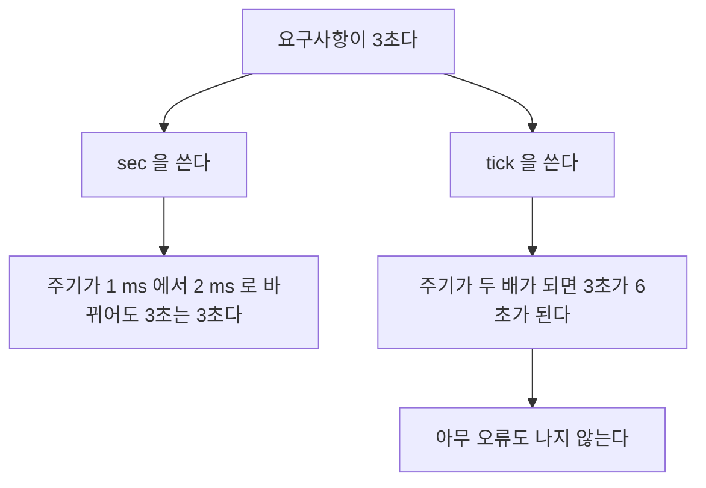

> **기준 출처:** [MathWorks Control Chart Execution by Using Temporal Logic](https://www.mathworks.com/help/stateflow/ug/using-temporal-logic-in-state-actions-and-transitions.html) · Temporal Logic Operators 문서 · Check State Activity by Using the in Operator와 hasChanged / 확인일 2026-08-07
> **시리즈:** [목차](/posts/00-mp-series/) | 이전 → [05. Data Scope와 타입](/posts/05-sf-data-scope-type/)

## 1. 왜 전용 연산자가 있는가

이 상태에 3초 이상 머물렀으면 다음으로 넘어간다를 표현하려면 일반적으로 다섯 단계가 필요하다. 카운터 Local Data를 만들고, `entry`에서 0으로 초기화하고, `during`에서 매 스텝 증가시키고, 조건에서 카운터와 임계값을 비교하고, 샘플 시간이 바뀌면 임계값을 다시 계산한다.

네 곳에 코드가 흩어지고 주기가 바뀌면 조용히 틀린다. 초기화를 빠뜨리면 이전 방문의 카운트가 남는다.

Stateflow의 시간 연산자는 이 다섯 단계를 `[after(3, sec)]` 한 줄로 대체한다. 카운터 관리와 리셋을 Stateflow가 담당하고 주기가 바뀌어도 초 단위 의미가 유지된다.

## 2. 기준이 되는 시점

시간 연산자는 모두 그 State에 진입한 시점을 기준으로 센다. State를 나갔다가 다시 들어오면 다시 0부터 센다. 이 성질이 수동 카운터 대비 가장 큰 이점이다. 리셋을 잊을 수가 없다.

## 3. 시간 단위

| 단위 | 의미 | 필요 조건 |
| --- | --- | --- |
| `sec` | 절대 시간, 초 | Chart가 이산이어야 한다 |
| `msec`과 `usec` | 밀리초와 마이크로초 | 위와 같다 |
| `tick` | Chart가 깨어난 횟수 | 조건이 없다 |
| 이벤트 이름 | 그 Event가 발생한 횟수 | 해당 Event가 있어야 한다 |



| | `sec` | `tick` |
| --- | --- | --- |
| 세는 것 | 경과 시간 | 실행 횟수 |
| 주기가 바뀌면 | 의미가 유지된다 | 의미가 바뀐다 |
| 권장 | 시간 요구사항을 표현할 때 | 실행 횟수 자체가 의미일 때 |

`sec` 계열을 쓰려면 Chart의 `ChartUpdate`가 이산이어야 하고 샘플 시간이 확정되어야 한다. [02편](/posts/02-sf-chart-properties/)에서 다뤘다.

## 4. 연산자

`after(n, 단위)`는 State 진입 후 n이 경과한 뒤부터 계속 참이다.

```text
[after(3, sec)]              진입 후 3초가 지났으면 참이고 그 이후로 계속 참이다
[after(10, tick)]            진입 후 10번 깨어났으면 참이다
```

가장 자주 쓰이는 연산자다. 타임아웃과 대기 시간과 디바운스 시간 표현에 쓴다. State Action에도 쓸 수 있다.

```text
on after(3, sec): timeout_flag = true;
```

이 형태는 3초가 지난 시점부터 매 실행마다 실행된다는 점에 주의한다. 한 번만 실행하려면 그 시점에 다른 State로 이동시키거나 플래그로 보호한다.

`before(n, 단위)`는 진입 후 n이 되기 전까지 참이고 `after`의 반대다. 제한 시간 안에 응답이 오면처럼 기한 내 조건을 표현할 때 쓴다.

`at(n, 단위)`는 진입 후 정확히 n번째 시점에만 참이고 그 전에도 그 후에도 거짓이다. 한 번만 일어나야 하는 동작에 쓰는데, 그 시점을 놓치면 영영 일어나지 않으므로 놓쳤을 때의 처리를 함께 설계한다.

`every(n, 단위)`는 진입 후 n마다 반복해서 참이다. 주기적 동작을 표현하고 State를 나가면 카운트가 리셋된다.


_시간 연산자는 Transition 라벨에 대괄호 없이 그대로 적는다. 그 자체가 조건이기 때문이다. `after`로 진입 후 일정 시간이 지나면 다음 State로 가고, `every`로 일정 시간마다 돌아온다. 카운터 변수도 초기화 코드도 그림에 없다. State 진입 시점을 기준으로 Stateflow가 알아서 세고 리셋한다. 같은 동작을 Local Data로 직접 구현하면 `entry`와 `during`과 조건 세 곳에 코드가 흩어진다._

`temporalCount(단위)`는 현재까지의 경과량을 값으로 반환한다. 조건이 아니라 값이 필요할 때 쓰고 경과 시간을 출력으로 내보내거나 비례 계산에 쓸 수 있다. `elapsed(sec)`은 진입 후 경과한 초를 값으로 반환하고 `temporalCount(sec)`와 같은 용도다.

| 연산자 | 참이 되는 구간 | 반환 |
| --- | --- | --- |
| `after(n,u)` | n 이후 계속 | 논리 |
| `before(n,u)` | n 이전까지 | 논리 |
| `at(n,u)` | 정확히 n에서만 | 논리 |
| `every(n,u)` | n마다 반복 | 논리 |
| `temporalCount(u)` | 해당 없다 | 경과량 값 |
| `elapsed(sec)` | 해당 없다 | 경과 초 값 |

## 5. 상태 조회 연산자

`in(경로)`는 지정한 State가 지금 활성인지 판정한다. 병렬 State 사이에서 서로의 상태를 참조할 때 쓰고, 오류 감시 State가 제어 State가 동작 중일 때만 판정하도록 만들 수 있다.

`in()`은 병렬 State 간의 결합을 만든다는 점에 주의한다. 실행 순서에 따라 같은 스텝의 상태를 볼 수도 이전 스텝의 상태를 볼 수도 있다.

`hasChanged` 계열은 지난 실행 이후 그 Data의 값이 바뀌었는지 판정한다.

| 연산자 | 판정 |
| --- | --- |
| `hasChanged(d)` | 값이 달라졌는가 |
| `hasChangedFrom(d, v)` | 특정 값에서 다른 값으로 바뀌었는가 |
| `hasChangedTo(d, v)` | 다른 값에서 특정 값으로 바뀌었는가 |

엣지 검출을 직접 구현하지 않아도 된다. 내부적으로 이전 값을 보관하므로 상태를 가진다는 점을 인지한다.

## 6. 자주 발생하는 문제

| 증상 | 원인 |
| --- | --- |
| `after(n, sec)`가 컴파일되지 않는다 | Chart가 이산이 아니다. `ChartUpdate`를 확인한다 |
| 주기를 바꿨더니 타이밍이 달라졌다 | `tick`을 썼다. `sec`으로 바꾼다 |
| `on after` Action이 여러 번 실행된다 | `after`는 그 시점 이후 계속 참이다. `at`을 쓰거나 이동으로 벗어난다 |
| 타이머가 리셋되지 않는다 | State를 벗어나지 않았다. 시간 연산자는 진입 시점 기준이다 |
| `at(n)`이 한 번도 성립하지 않는다 | 그 시점 전에 다른 조건으로 이동했다 |
| `in()` 결과가 스텝마다 다르게 보인다 | 병렬 State 실행 순서에 의존한다 |

## 정리

- 시간 연산자는 카운터 관리와 리셋을 자동으로 해 준다. 수동 카운터의 리셋 누락 문제가 사라진다.
- 기준은 항상 State 진입 시점이고 나갔다 들어오면 다시 0부터 센다.
- `sec`은 주기가 바뀌어도 의미가 유지되고 `tick`은 바뀐다. 시간 요구사항에는 `sec`을 쓴다.
- `sec` 계열은 Chart가 이산이어야 쓸 수 있다.
- `after`는 이후 계속, `before`는 이전까지, `at`은 그 시점만, `every`는 반복이다.
- `temporalCount`와 `elapsed`는 논리가 아니라 값을 준다.
- `in()`은 병렬 State 간 결합을 만들며 실행 순서에 의존한다.
- `hasChanged` 계열은 내부에 이전 값을 보관하므로 상태를 가진다.

## 확인 문제

1. 수동 카운터 대신 `after(3, sec)`를 쓸 때 없어지는 실수 두 가지를 쓰라.
2. `tick` 대신 `sec`을 권장하는 이유를 주기 변경 시나리오로 설명하라.
3. `after(5, sec)`와 `at(5, sec)`의 차이를 참이 되는 구간으로 설명하라.
4. `on after(3, sec): flag = true;`를 한 번만 실행되게 하려면 어떻게 해야 하는가.

## 참고

- [MathWorks — Control Chart Execution by Using Temporal Logic](https://www.mathworks.com/help/stateflow/ug/using-temporal-logic-in-state-actions-and-transitions.html)
- MathWorks Stateflow — Temporal Logic Operators, in Operator, hasChanged