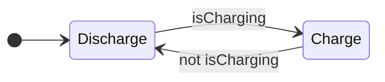

> **기준:** MathWorks 공개 문서 / 최종 갱신 2026-07-31

Stateflow로 FSM을 설계하는 데 필요한 것을 22편으로 정리한다. 22편 전체에서 배터리 충전 제어를 공통 예제로 쓴다.

시리즈가 커지면서 여섯 구간이 됐다. **앞의 두 구간(01~11)이 Chart 를 만들고 그것이 언제 도는지를 다루고, 뒤의 네 구간(12~22)이 설계 판단, 관측, 검증, 자동화를 다룬다.**

---

## 기초 — Chart 만들기 (01~07)

| # | 글 | 다루는 것 |
| --- | --- | --- |
| 01 | [FSM이 필요한 이유](/posts/01-why-fsm/) | `if` 문의 한계, State와 Transition |
| 02 | [첫 Chart — State, Transition, Action](/posts/02-first-chart/) | Default Transition, 라벨 3부분, `entry`/`during`/`exit`, Chart Data |
| 03 | [로깅과 디버깅](/posts/03-logging-and-debug/) | Active State 로깅, 조건부 Breakpoint |
| 04 | [계층 State](/posts/04-hierarchy/) | Parent와 Child, 계층이 절약하는 것 |
| 05 | [Junction과 Flow Chart](/posts/05-junction/) | 경로 평가, Execution Order, Inner Transition |
| 06 | [병렬 State와 Event](/posts/06-parallel-and-events/) | Exclusive(OR)와 Parallel(AND), `send()` |
| 07 | [Function으로 재사용](/posts/07-functions/) | Graphical, MATLAB, Simulink Function |

## 실행 순서 (08~11)

**같은 Chart가 다르게 도는 이유**를 다룬다. 안전critical 설계에서 가장 중요한 부분이다.

| # | 글 | 다루는 것 |
| --- | --- | --- |
| 08 | [Chart 실행 순서](/posts/08-chart-execution/) | 깨어나서 잠들 때까지 1 스텝, `during`이 실행되지 않는 조건 |
| 09 | [Condition Action과 Transition Action](/posts/09-condition-action/) | 실행 시점의 차이, Backtracking의 부작용 |
| 10 | [병렬 State의 실행 순서](/posts/10-parallel-order/) | active와 실행은 다른 축, 공유 Data 문제 |
| 11 | [Super Step](/posts/11-super-step/) | 한 스텝에 Transition 연쇄, 반복 한계 |

## 설계 판단 (12, 15~17)

**무엇을 어떻게 그릴지**를 정하는 구간이다.

| # | 글 | 다루는 것 |
| --- | --- | --- |
| 12 | [debounce와 duration](/posts/12-debounce/) | 노이즈 제거, `duration` 연산자 |
| 15 | [Bus Signals](/posts/15-sf-bus-signals/) | `Simulink.Bus` 구조체, 비가상 버스 제약, field 소유자 |
| 16 | [어느 형태로 그릴 것인가](/posts/16-sf-chart-type-choice/) | State / Flow Chart / Table / Truth Table, Simulink 와의 경계 |
| 17 | [History Junction](/posts/17-sf-history-junction/) | 이전 활성 substate 복귀와 그 대가 |

## 관측과 디버깅 (14, 19)

| # | 글 | 다루는 것 |
| --- | --- | --- |
| 14 | [Simulation Data Inspector](/posts/14-sf-data-inspector/) | State 활동과 Data 로깅, `logsout`, 회귀 검증으로 잇기 |
| 19 | [Sequence Viewer와 애니메이션](/posts/19-sf-sequence-viewer/) | 도구마다 답하는 질문이 다르다, Activity Profiler |

## 검증 (18, 21~22)

**"테스트했다"와 "검증했다"를 가르는 선**을 다룬다.

| # | 글 | 다루는 것 |
| --- | --- | --- |
| 18 | [edit-time 검사](/posts/18-sf-edit-time-checks/) | 매달린 Transition, shadowing, 도달 불가 State |
| 21 | [관찰과 증명 — 커버리지](/posts/21-sf-coverage/) | Execution / Decision / Condition / MC-DC, 100%가 뜻하지 않는 것 |
| 22 | [형식 증명](/posts/22-sf-formal-verification/) | dead logic, 속성 증명, 반례 제시 |

## 자동화 (20)

| # | 글 | 다루는 것 |
| --- | --- | --- |
| 20 | [Stateflow API 기초](/posts/20-sf-api-basics/) | `sfroot`, `find`, 논리 서명 비교 |
| 13 | [User's Guide 찾아 쓰기](/posts/13-users-guide/) | 1,250쪽 레퍼런스 탐색법 |

> API 를 실제 모델에 적용한 사례는 별도 연재로 있다 → [Stateflow 레이아웃을 코드로 만들기](/posts/00-sflayout-series/) (6편)
{: .prompt-tip }

---

## 공통 예제

State 두 개에서 시작해 계층, 병렬, Function으로 확장한다. 01편의 `if` 문 버전이 07편에서 완성된 Chart가 된다.

## 읽는 순서

| 목적 | 순서 |
| --- | --- |
| 처음 배운다 | 01 → 07 순서대로 |
| Chart는 만들 줄 안다 | **08 → 11** (실행 순서만) |
| 돌아가는 건 봤고 맞는지 알고 싶다 | **18 → 21 → 22** (검증) |
| 큰 모델을 검토해야 한다 | **20** → [레이아웃 연재](/posts/00-sflayout-series/) |
| 특정 개념만 확인 | 위 표에서 해당 편으로 |

> ⚠️ **08~11편이 실무에서 가장 자주 문제가 되는 영역이다.** Chart를 그릴 줄 아는 것과 그 Chart가 언제 무엇을 실행하는지 아는 것은 다르다. 병렬 State의 실행 순서(10편)와 Backtracking의 부작용(09편)은 그림만 봐서는 드러나지 않는다.

> 📌 **21~22편은 성격이 다르다.** 앞의 관측 도구들은 전부 **실행해본 것**을 보여준다. 실행하지 않은 조건 조합에 대해서는 아무것도 보장하지 않는다는 사실에서 커버리지와 형식 증명이 출발한다.

## 참고

- [Stateflow Documentation](https://www.mathworks.com/help/stateflow/)
- [Design Finite State Machines in Stateflow](https://www.mathworks.com/help/stateflow/gs/get-started-introduction.html)
