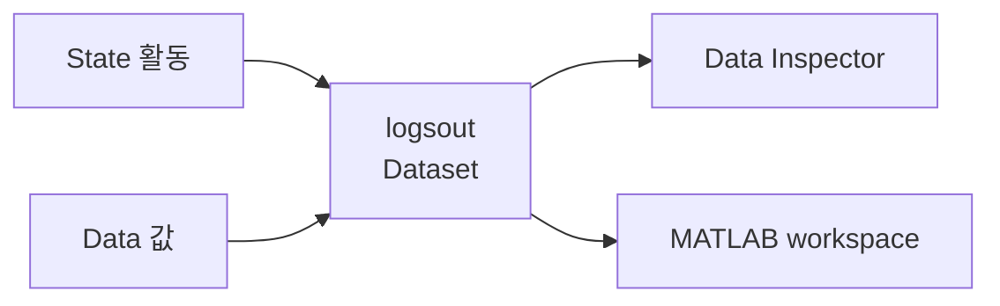
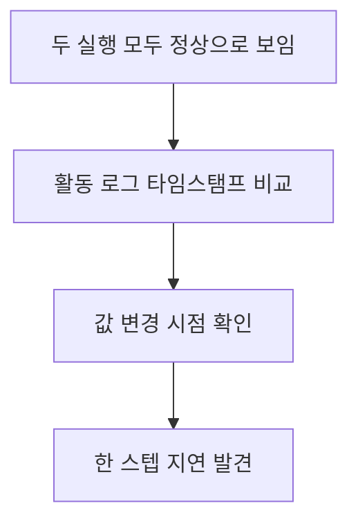

> **기준:** MathWorks 공개 문서 · R2025b / 확인일 2026-07-31
> **시리즈:** [목차](/posts/00-stateflow-series/) · 이전 → [13. User's Guide](/posts/13-users-guide/) · 다음 → [15. Bus Signals](/posts/15-sf-bus-signals/)

---

## 1. 애니메이션의 한계

[03편](/posts/03-logging-and-debug/)에서 로깅을 켜고 breakpoint를 거는 방법을 다뤘다. 이 글은 그렇게 남긴 로그를 실제 검증에 쓰는 쪽을 정리한다.

Chart를 돌리면 활성 State 테두리가 강조된다. 여기서 알 수 있는 것은 한정적이다.

| 확인 대상 | 애니메이션 |
| --- | --- |
| 어느 State가 활성인가 | 보인다 |
| 언제 몇 번 드나들었는가 | 안 보인다 |
| Data 값이 범위 안인가 | 안 보인다 |
| 두 실행이 어떻게 다른가 | 안 보인다 |

> **실행된다는 것과 요구사항을 지킨다는 것은 다른 명제다.** 모드는 눈으로 보이지만 값은 안 보인다.
{: .prompt-danger }

## 2. 로깅 대상 두 종류

| 대상 | 켜는 곳 | 남는 것 |
| --- | --- | --- |
| **State 활동** | State 선택 → Property Inspector → Logging → `Log self activity` | 그 State가 활성이던 구간 |
| **Data 값** | Data 선택 → Property Inspector → Logging | 변수의 시간 변화 |

Chart 전체를 한 번에 켜고 끄려면 Simulation 탭의 `Log Chart Signals` 를 쓴다. 기본값은 켜져 있다. 부모 State 아래 어느 자식이 활성인지 매 스텝 남기려면 `Log Child Activity` 를 쓴다.

전역 설정은 Configuration Parameters의 Data Import/Export 창에 있는 Signal logging 이다.

로깅이 켜지면 **State 왼쪽 아래에 배지가 표시된다.** 무엇이 켜져 있는지 차트만 봐도 알 수 있다는 뜻이라, 설정을 놓쳐서 로그가 비는 사고를 줄여준다.

## 3. 어디에 쌓이나

로그는 `Simulink.SimulationData.Dataset` 객체로 모인다. 기본 변수명은 `logsout` 이다.

| 클래스 | 담는 것 |
| --- | --- |
| `Stateflow.SimulationData.State` | State 활동 |
| `Stateflow.SimulationData.Data` | Data 값 |

## 4. 두 경로가 같은 데이터를 본다

| 경로 | 쓸 때 |
| --- | --- |
| Simulation 탭의 `Data Inspector` | 눈으로 파형 확인, 실행 간 비교 |
| workspace 의 `logsout` | 스크립트로 판정, 자동 검증 |

이 점이 회귀 검증에서 중요하다. **눈으로 볼 때와 테스트로 판정할 때 대상이 달라지지 않는다.** 사람이 SDI에서 이상하다고 본 구간을 그대로 코드로 집어 판정 조건을 만들 수 있다.

## 5. 실행 순서 문제는 로그로만 보인다

[08편](/posts/08-chart-execution/)과 [10편](/posts/10-parallel-order/)에서 다룬 문제를 떠올려보면, 병렬 State끼리 같은 변수를 쓸 때 실행 순서에 따라 한 스텝 지연이 생긴다.

| 실행 순서 | 결과 |
| --- | --- |
| 쓰는 State 먼저 | 같은 스텝에 반영 |
| 읽는 State 먼저 | **한 스텝 지연** |

이 차이는 애니메이션으로 안 보인다. 두 경우 모두 State가 정상적으로 오간다. **활동 로그의 타임스탬프를 봐야 드러난다.** 값이 언제 바뀌었는지와 State가 언제 전이했는지를 같은 시간축에 놓고 봐야 한다.

## 6. 회귀 검증으로 잇기

SDI는 사람이 보는 도구다. 반복 검증은 `logsout` 을 코드로 읽는 쪽이 맞다.

- 어느 State에 들어갔는지, 몇 번 들어갔는지를 활동 로그로 판정한다.
- Data 로그로 값 범위와 정상 종료 여부를 판정한다.
- 기준 실행을 저장해두고 다음 실행과 비교한다.

이름이 길어 판정 코드가 지저분해지면 Property Inspector에서 `Logging Name` 을 `Custom` 으로 두고 짧은 이름을 준다.

## ⚠️ 주의

- **`Log self activity` 와 `Log Child Activity` 의 정확한 차이는 공개 문서 본문에 상세히 서술돼 있지 않다.** R2025b에서 직접 켜서 확인하는 편이 확실하다. 이 글은 문서에 적힌 범위까지만 쓴다.
- 메뉴 위치와 항목 이름은 릴리스마다 바뀐다. 문서 표기 기준으로 적었다.
- 로깅을 많이 켜면 시뮬레이션이 느려지고 파일이 커진다. 검증에 쓸 항목만 켜는 편이 낫다.

## 📌 정리

- 애니메이션은 **모드만** 보여준다. 값과 시각은 로그로만 남는다.
- 로깅 대상은 **State 활동**과 **Data 값** 둘이다. Chart 단위는 `Log Chart Signals`, 자식 State는 `Log Child Activity`.
- 로그는 `logsout` 이라는 `Simulink.SimulationData.Dataset` 에 모인다.
- **SDI와 workspace가 같은 데이터를 본다.** 눈으로 찾은 문제를 그대로 코드 판정으로 옮길 수 있다.
- 병렬 State의 한 스텝 지연 같은 문제는 **활동 로그 타임스탬프**로만 확인된다.

---

**시리즈:** [목차](/posts/00-stateflow-series/) · 이전 → [13. User's Guide 찾아 쓰기](/posts/13-users-guide/) · 다음 → [15. Bus Signals](/posts/15-sf-bus-signals/)

## 참고

- [Log Simulation Output for States and Data](https://www.mathworks.com/help/stateflow/ug/log-states-and-data.html)
- [View State Activity by Using the Simulation Data Inspector](https://www.mathworks.com/help/stateflow/ug/view-state-activity-using-simulation-data-inspector.html)
- [Configure Signal Logging for Stateflow Charts](https://www.mathworks.com/help/stateflow/ug/configure-signal-logging-for-stateflow-charts.html)
- [Stateflow.SimulationData.Data](https://www.mathworks.com/help/stateflow/ref/stateflow.simulationdata.data.html)
- [Simulation Data Inspector](https://www.mathworks.com/help/simulink/simulation-data-inspector.html)
