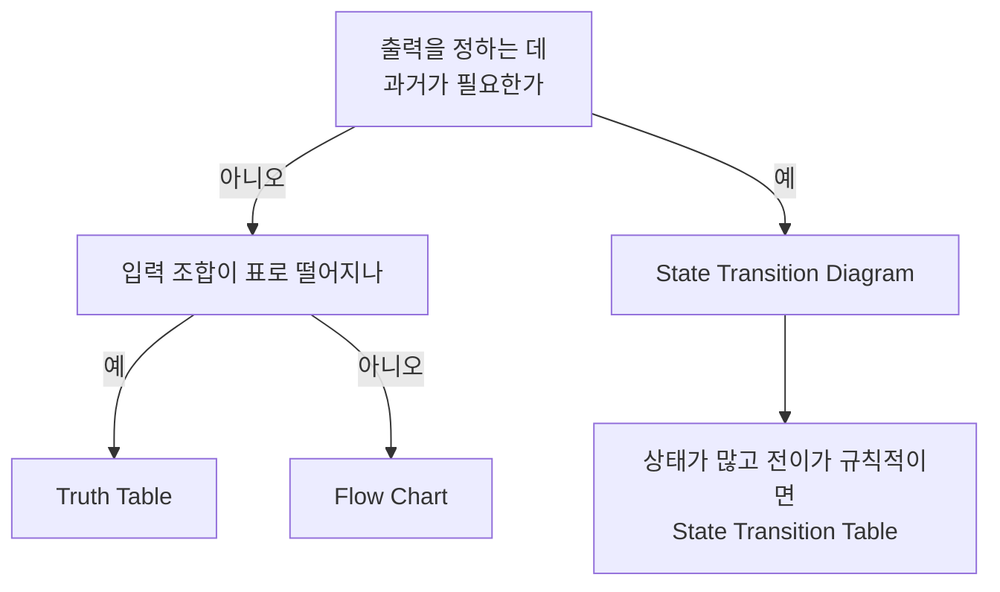

> **기준:** MathWorks 공개 문서 / R2025b / 확인일 2026-07-31
> **시리즈:** [목차](/posts/00-stateflow-series/) | 이전 → [15. Bus Signals](/posts/15-sf-bus-signals/) | 다음 → [17. History Junction](/posts/17-sf-history-junction/)

---

## 1. Stateflow 가 제공하는 형태는 넷이다

[01편](/posts/01-why-fsm/)에서 FSM 이 왜 필요한지를 다뤘다. 그런데 Stateflow 를 쓰기로 정했다고 그리는 방식이 하나로 정해지지는 않는다.

| 형태 | 무엇에 맞나 |
| --- | --- |
| **State Transition Diagram** | 이력에 의존하는 반응형 감독 시스템 |
| **Flow Chart** | 조건 분기와 반복 같은 제어 흐름 |
| **State Transition Table** | 같은 내용을 표로. 상태가 많고 전이가 규칙적일 때 |
| **Truth Table** | 입력 조합에 대한 출력이 표로 떨어질 때 |

## 2. 판단 기준은 이력이 필요한가다

> **지금 입력만으로 출력이 정해지면 State 가 필요 없다.** 과거에 무엇을 했는지가 결과를 바꿀 때만 State 를 만든다.
{: .prompt-tip }

State 를 안 써도 되는데 쓰면 상태 수가 불어난다. 반대로 이력이 필요한데 Flow Chart 로 짜면 그 이력이 변수로 흩어져서 [01편](/posts/01-why-fsm/)에서 말한 문제로 되돌아간다.

## 3. 한 Chart 안에서 섞을 수 있다

Junction 은 Transition 사이의 중간 지점이다. Junction 을 이어 붙이면 Flow Chart 가 된다. [05편](/posts/05-junction/)에서 다룬 그 Junction 이다.

즉 두 방식은 배타적이지 않다.

- **바깥은 State** 로 모드를 나누고
- **State 안의 판단 로직은 Flow Chart** 로 짠다

이 조합이 실무에서 가장 흔하다. 모드 전환은 그림으로 보이고, 세부 조건은 흐름으로 읽힌다.

## 4. Simulink 와의 경계

MAB 가이드라인이 이 구분을 다룬다. 대체로 이렇게 나뉜다.

| | 맡는 것 |
| --- | --- |
| **Simulink** | 연속적인 수치 연산 |
| **Stateflow** | 이산적인 모드 전환과 판단 |

경계를 어기면 양쪽 다 읽기 어려워진다.

- 수치 계산을 Chart 안에 밀어 넣으면 **State 다이어그램이 안 읽힌다.** 그림의 값어치가 사라진다.
- 모드 전환을 Simulink 블록으로 짜면 **조건이 흩어진다.** 어느 조건이 우선인지 그림에 안 나온다.

## ⚠️ 주의

- **State Transition Table 과 Truth Table 의 코드 생성 결과 차이는 확인하지 않았다.** 임베디드 타깃에서 어느 쪽이 유리한지는 따로 봐야 한다.
- 위 판단 기준은 **읽기 쉬움**을 우선한 것이다. 인증 맥락에서는 조직의 모델링 표준이 형태를 지정하는 경우가 있다.
- 하나로 정해두고 시작하기보다, 도중에 형태가 안 맞는다고 느껴지면 **그때 바꾸는 편이 낫다.** 늦게 바꿀수록 비싸진다.

## 📌 정리

- Stateflow 의 그래픽 언어는 **네 가지**다. Stateflow 를 쓰기로 한 것과 어떻게 그릴지는 별개 결정이다.
- **판단 기준은 이력이 필요한가**다. 지금 입력만으로 정해지면 State 를 만들지 않는다.
- Junction 을 이으면 Flow Chart 다. **바깥은 State, 안은 Flow Chart** 조합이 흔하다.
- **연속 수치는 Simulink, 이산 모드는 Stateflow.** 섞으면 양쪽 다 안 읽힌다.

---

**시리즈:** [목차](/posts/00-stateflow-series/) | 이전 → [15. Bus Signals](/posts/15-sf-bus-signals/) | 다음 → [17. History Junction](/posts/17-sf-history-junction/)

## 참고

- [Get Started with Stateflow](https://www.mathworks.com/help/stateflow/getting-started.html)
- [Using Simulink and Stateflow in Modeling (MAB)](https://www.mathworks.com/help/simulink/mdl_gd/maab/using-simulink-and-stateflow-in-modeling.html)
- [Stateflow.Junction](https://www.mathworks.com/help/stateflow/api/stateflow.junction.html)
- [How Stateflow Objects Interact During Execution](https://www.mathworks.com/help/stateflow/ug/how-chart-constructs-interact-during-execution.html)
