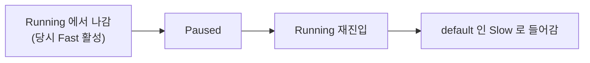
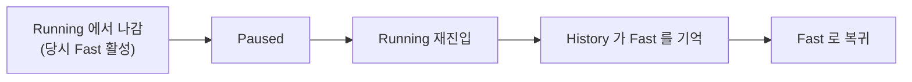

> **기준:** MathWorks 공개 문서 · R2025b / 확인일 2026-07-31
> **시리즈:** [목차](/posts/00-stateflow-series/) · 이전 → [16. 어느 형태로 그릴 것인가](/posts/16-sf-chart-type-choice/) · 다음 → [18. edit-time 검사](/posts/18-sf-edit-time-checks/)

---

## 1. 기본 동작 — 항상 default 로 들어간다

[04편](/posts/04-hierarchy/)에서 계층 State 를 다뤘다. 부모 State 에 다시 들어가면 어느 자식으로 가는가.

**default transition 이 가리키는 substate 로 간다.** 직전에 어디 있었는지와 무관하다.

일시정지 후 복귀 같은 흐름에서는 이것이 곤란하다. 멈추기 전 상태로 돌아가야 하는데 처음부터 다시 시작한다.

## 2. History Junction

State 안에 **History Junction** 을 두면 동작이 바뀐다.

- **OR 분해**(Or-composition) 안에 둔다.
- 그 State 가 다시 활성이 되면 **이전에 활성이던 substate 로 들어간다.**
- **default transition 과 무관하게** 동작한다.

전형적인 용도다.

| 흐름 | History 로 얻는 것 |
| --- | --- |
| 일시정지 후 복귀 | 멈춘 지점의 모드로 돌아간다 |
| fault 해제 후 복귀 | fault 직전 동작 모드를 유지한다 |
| 모드 전환 후 원복 | 수동 조작 후 자동 모드의 이전 단계로 |

## 3. 대가 — 복귀 지점이 그림에서 사라진다

편리한 만큼 잃는 것이 있다.

**default transition 은 화살표로 보인다.** 차트를 보면 어디로 들어가는지 알 수 있다. History Junction 은 **"직전 상태로"** 라고만 말하고, 그 직전이 무엇이었는지는 실행 이력에 있다. 그림에 없다.

| | default transition | History Junction |
| --- | --- | --- |
| 진입 지점 | 그림에 보인다 | 실행 이력에 있다 |
| 정적 검토 | 가능 | 어렵다 |
| 상태 수 | 명확 | 부모 진입 경로마다 달라짐 |

> **안전 관련 전이에서는 명시적 전이가 검토에 유리하다.** fault 해제 후 어디로 돌아가는지가 요구사항에 적혀 있어야 하고, 그것이 그림에 보이는 편이 리뷰가 된다. History 로 두면 리뷰어가 실행해봐야 안다.
{: .prompt-warning }

이것은 History 를 쓰지 말라는 뜻이 아니다. **어디로 돌아가는지가 요구사항에 명시돼 있는가**를 먼저 확인하라는 뜻이다. 명시돼 있으면 History 로 구현해도 되고, 명시돼 있지 않다면 History 가 요구사항의 빈칸을 덮고 있는 것이다.

## 4. 검증에서 걸리는 지점

History 가 있으면 같은 부모 State 진입이라도 **결과가 여러 가지**다. 그래서 다음이 늘어난다.

- 테스트해야 할 경로가 늘어난다. 부모에 들어가는 경우마다 자식이 다를 수 있다.
- [21편](/posts/21-sf-coverage/)에서 다룰 커버리지 목표를 채우기가 까다로워진다.
- 초기 실행에서는 이력이 없으므로 **첫 진입은 default 로 간다.** 이 경우를 빼먹기 쉽다.

마지막 항목이 실수하기 좋다. History 를 두었다고 항상 복귀하는 것이 아니라, **한 번도 활성이었던 적이 없으면 default 가 쓰인다.**

## ⚠️ 주의

- History Junction 은 **OR 분해** 안에서 의미가 있다. AND(병렬) 분해에서는 자식이 전부 활성이므로 기억할 대상이 다르다.
- 계층이 깊을 때 History 가 **어느 깊이까지 기억하는지**는 배치한 위치가 정한다. 부모에 하나 두었다고 손자까지 복귀하지는 않는다. 손자 복귀가 필요하면 그 층에도 둔다.
- 첫 진입 동작(이력 없음 → default)은 문서보다 **직접 돌려서 확인**하는 편이 확실하다.

## 📌 정리

- 기본은 **default transition** 이다. 직전에 어디 있었는지와 무관하게 정해진 substate 로 들어간다.
- **History Junction** 을 OR 분해 안에 두면 이전 활성 substate 로 복귀한다.
- **첫 진입은 이력이 없으므로 default 로 간다.** 빼먹기 쉬운 경우다.
- 대가는 **복귀 지점이 그림에서 사라지는 것**이다. 정적 검토가 어려워진다.
- 안전 관련이면 먼저 묻는다. **어디로 돌아가는지가 요구사항에 적혀 있는가.**

---

**시리즈:** [목차](/posts/00-stateflow-series/) · 이전 → [16. 어느 형태로 그릴 것인가](/posts/16-sf-chart-type-choice/) · 다음 → [18. edit-time 검사](/posts/18-sf-edit-time-checks/)

## 참고

- [Resume Prior Substate Activity by Using History Junctions](https://www.mathworks.com/help/stateflow/ug/recording-state-activity-with-history-junctions.html)
- [Stateflow.Junction](https://www.mathworks.com/help/stateflow/api/stateflow.junction.html)
- [Enter a Chart or State](https://www.mathworks.com/help/stateflow/ug/chart-initialization-and-entry-actions.html)
- [How Stateflow Objects Interact During Execution](https://www.mathworks.com/help/stateflow/ug/how-chart-constructs-interact-during-execution.html)
