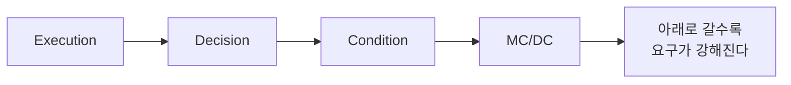
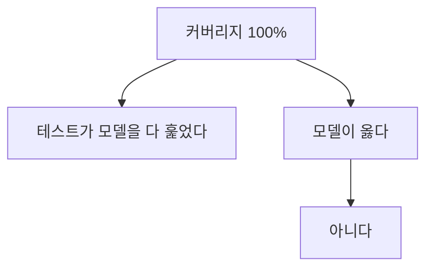

> **기준:** MathWorks 공개 문서 / R2025b / 확인일 2026-07-31
> **시리즈:** [목차](/posts/00-stateflow-series/) | 이전 → [20. Stateflow API](/posts/20-sf-api-basics/) | 다음 → [22. 형식 증명](/posts/22-sf-formal-verification/)

---

## 1. 관찰과 증명은 다른 명제다

[14편](/posts/14-sf-data-inspector/)과 [19편](/posts/19-sf-sequence-viewer/)의 도구는 전부 **실행해본 것**을 보여준다.

| | 답하는 질문 |
| --- | --- |
| **관찰** | 내가 넣은 입력에 대해 그렇게 동작했다 |
| **증명** | **어떤 입력에도** 그렇지 않은 경우가 없다 |

> 시뮬레이션은 실행한 시나리오에서 관측된 동작만 보여준다. 실행하지 않은 입력이나 조건 조합의 동작은 보장하지 않는다.
{: .prompt-danger }

**안전critical 개발에서 "테스트했다"와 "검증했다"를 가르는 선이 여기다.** 커버리지는 그 사이에 있다. 증명은 아니지만 **얼마나 훑었는지**를 숫자로 준다.

## 2. 커버리지 네 종류

Simulink Coverage 가 재는 것이다.

| 종류 | 무엇을 본다 |
| --- | --- |
| **Execution** | 그 객체가 한 번이라도 실행됐나 |
| **Decision** | 판단 지점이 참과 거짓 **양쪽**으로 갔나 |
| **Condition** | 논리식의 **개별 항**이 참과 거짓 양쪽을 가졌나 |
| **MC/DC** | 개별 항 하나만 바꿔 **전체 결과가 뒤집히는** 경우를 다 봤나 |

아래로 갈수록 요구가 강해진다. Decision 이 100% 여도 Condition 은 아닐 수 있고, Condition 이 100% 여도 MC/DC 는 아닐 수 있다.

## 3. Stateflow 에서의 적용

문서가 명시한 내용이다.

- **Decision** — Chart 안에서 판단 지점에 해당하는 **State** 와 블록을 본다.
- **Condition 과 MC/DC** — **Chart 자체에는 NA 이고 하위 객체에 적용된다.**
- **MC/DC** — 논리 조합을 출력하는 블록과 **Transition 조건**을 본다. 논리 입력들이 서로 **독립적으로** 결과를 바꾸는지 확인한다.

세 번째가 요점이다. Transition 라벨의 `[...]` 안에 `a && b || c` 같은 식을 쓰면 그것이 MC/DC 대상이다. 조건을 길게 쓸수록 채워야 할 조합이 늘어난다.

| 조건식 | MC/DC 가 요구하는 것 |
| --- | --- |
| `[a]` | a 가 참과 거짓 |
| `[a && b]` | 각 항이 단독으로 결과를 뒤집는 경우 |
| `[a && b \|\| c]` | 항이 늘수록 조합이 늘어난다 |

**조건식을 짧게 쓰는 것이 검증 비용을 줄인다.** 긴 조건을 하나 쓰기보다 Junction 으로 나누는 편이 나을 때가 있다.

## 4. MC/DC 정의가 두 가지다

이것을 모르면 나중에 곤란해진다.

Simulink Coverage 는 기본으로 **masking** 정의를 쓴다. 설정 파라미터 `CovMcdcMode` 를 `UniqueCause` 로 바꿀 수 있다.

> 정의를 바꾸면 **Simulink Coverage 의 보고와 Simulink Design Verifier 의 테스트 생성 결과가 달라질 수 있다.**
{: .prompt-warning }

인증 문서가 어느 정의를 요구하는지 먼저 확인하고 맞춰야 한다. 나중에 바꾸면 이미 만든 테스트의 근거가 흔들린다.

## 5. 커버리지 100% 가 뜻하지 않는 것

세 가지를 구분해야 한다.

- **커버리지가 낮다** → 대체로 **테스트의 문제**다. 모델이 틀렸다는 뜻이 아니다.
- **커버리지가 100% 다** → 훑었다는 뜻이지 **요구사항을 만족한다는 뜻이 아니다.** 훑은 것과 맞는 것은 다르다.
- **아무리 테스트를 만들어도 안 채워지는 곳이 있다** → **도달 자체가 불가능한 로직**일 수 있다. 이건 테스트 문제가 아니라 설계 결함이다.

마지막이 [22편](/posts/22-sf-formal-verification/)의 형식 분석으로 넘어가는 지점이다. 커버리지는 **"못 채웠다"** 까지만 말하고 **"채울 수 없다"** 는 말해주지 않는다.

## ⚠️ 주의

- **Simulink Coverage 는 별도 라이선스 제품이다.** 보유 여부에 따라 쓸 수 있는 범위가 다르다.
- 인증(DO-178C, ISO 26262) 맥락에서 어떤 도구 자격이 필요한지는 이 글 범위 밖이다. MathWorks 가 별도 자격 키트를 제공한다는 것까지만 확인했다.
- [17편](/posts/17-sf-history-junction/)의 History Junction 이 있으면 같은 부모 진입이라도 결과가 여러 가지라 커버리지 목표를 채우기가 까다로워진다.

## 📌 정리

- **관찰과 증명은 다른 명제다.** 앞의 관측 도구는 전부 관찰이다.
- 커버리지 종류는 **Execution → Decision → Condition → MC/DC** 순으로 요구가 강해진다.
- Stateflow 에서 **Condition 과 MC/DC 는 Chart 자체엔 NA** 이고 하위 객체에 적용된다.
- **MC/DC 는 Transition 조건을 본다.** 조건식이 길수록 채울 조합이 늘어난다.
- **MC/DC 정의가 masking 과 UniqueCause 둘이다.** 인증 요구와 맞춰서 먼저 정한다.
- **커버리지 100% 는 훑었다는 뜻이지 옳다는 뜻이 아니다.** 못 채우는 곳은 설계 결함일 수 있다.

---

**시리즈:** [목차](/posts/00-stateflow-series/) | 이전 → [20. Stateflow API 기초](/posts/20-sf-api-basics/) | 다음 → [22. 형식 증명 — Simulink Design Verifier](/posts/22-sf-formal-verification/)

## 참고

- [Types of Coverage for Stateflow Charts](https://www.mathworks.com/help/slcoverage/ug/types-of-coverage-stateflow.html)
- [Model Coverage for Stateflow Charts](https://www.mathworks.com/help/slcoverage/ug/coverage-for-stateflow-charts.html)
- [Types of Model Coverage](https://www.mathworks.com/help/slcoverage/ug/types-of-model-coverage.html)
- [MCDC Definitions in Simulink Coverage](https://www.mathworks.com/help/slcoverage/ug/modified-condition-and-decision-coverage-definitions-in-simulink-verification-and-validation.html)
