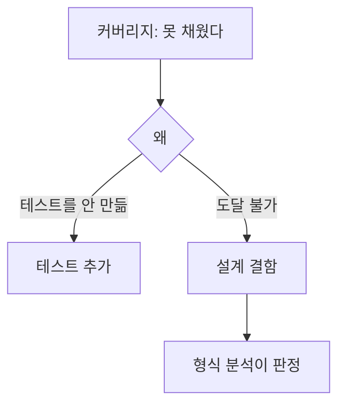
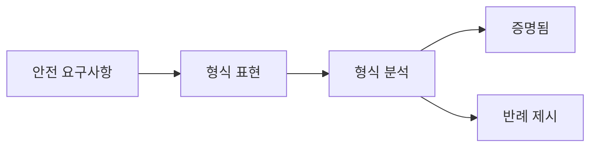
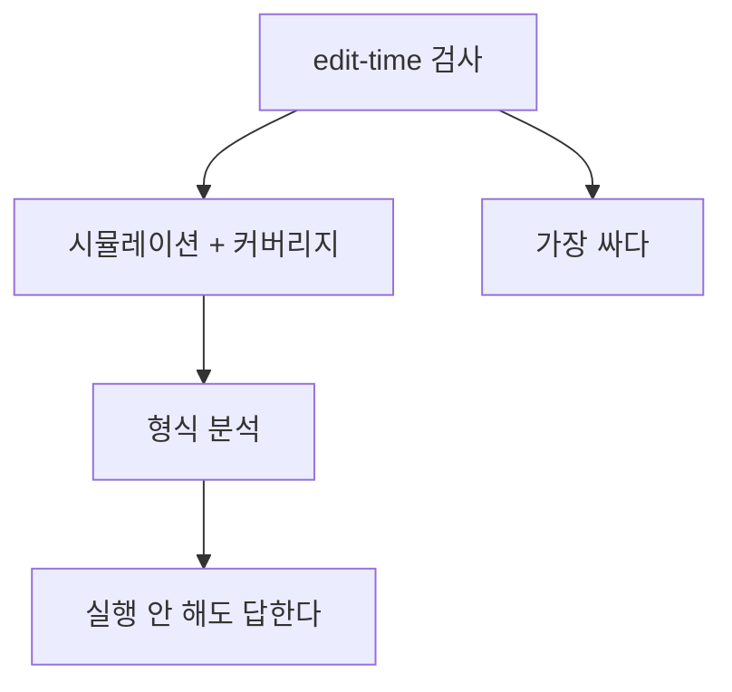

> **기준:** MathWorks 공개 문서 / R2025b / 확인일 2026-07-31
> **시리즈:** [목차](/posts/00-stateflow-series/) | 이전 → [21. 관찰과 증명](/posts/21-sf-coverage/)

---

## 1. 실행하지 않고 답한다

[21편](/posts/21-sf-coverage/)의 커버리지는 **"내가 만든 테스트가 얼마나 훑었나"** 에 답했다. 답하지 못한 것이 하나 남았다. **채울 수 없는 곳이 왜 채워지지 않는가.**

Simulink Design Verifier 는 형식 기법으로 모델을 분석한다. **시뮬레이션 없이** 설계 오류를 찾는다.

## 2. 무엇을 하는가

| 기능 | 무엇 |
| --- | --- |
| **설계 오류 검출** | 정수 오버플로, **dead logic**, 배열 접근 위반, 0 나눗셈 |
| **속성 증명** | 안전 요구사항을 만족하는지 형식 검증 |
| **테스트 생성** | 커버리지 목표를 채우는 테스트 케이스 자동 생성 |
| **반례 제시** | 오류나 요구사항 위반마다 **디버깅용 시뮬레이션 테스트 케이스** 생성 |

네 번째가 실무에서 가장 중요하다. 뒤에서 따로 다룬다.

## 3. dead logic

**dead logic** 은 시뮬레이션과 생성 코드 실행 중 **절대 활성화될 수 없는** 객체다. 형식 분석이 이것을 찾아 리포트한다.

[18편](/posts/18-sf-edit-time-checks/)의 edit-time 검사와 층이 다르다.

| | 판정 근거 | 잡는 것 |
| --- | --- | --- |
| **edit-time** | 구조 | 도착지 없는 Transition, 명백히 가려진 경로 |
| **형식 분석** | **값의 도달 가능성** | 구조상 멀쩡한데 입력 범위상 절대 참이 안 되는 조건 |

예를 들어 앞선 State 에서 `x` 가 0에서 100 사이로만 나오는데 어떤 Transition 이 `[x > 200]` 을 요구한다면, 구조는 정상이고 편집기도 조용하다. 그런데 그 경로는 죽어 있다. **모델 전체를 봐야 알 수 있는 것**이라 edit-time 이 못 잡는다.

dead logic 이 나왔다는 것은 대체로 둘 중 하나다.

- 요구사항을 잘못 이해했다
- 조건식이나 상수를 잘못 썼다

둘 다 **설계 결함이지 테스트 부족이 아니다.**

## 4. 속성 증명

안전 요구사항을 MATLAB, Simulink, Stateflow 로 표현하면 그것을 **형식 검증**한다.

여기서 답하는 질문이 시뮬레이션과 다르다.

| | 답 |
| --- | --- |
| 시뮬레이션 | 이 입력에서는 위반하지 않았다 |
| 속성 증명 | **어떤 입력에서도** 위반하지 않는다 |

예를 들어 *"EmergencyStop 이 걸린 동안에는 모터 출력이 0 이어야 한다"* 같은 요구사항이라면, 시뮬레이션은 만들어본 시나리오에서만 확인해준다. 형식 분석은 그 명제 자체를 판정한다.

## 5. 반례를 생성한다

**"위반이 있다"** 로 끝나면 쓸모가 적다. Simulink Design Verifier 는 오류나 요구사항 위반마다 **그것을 재현하는 시뮬레이션 테스트 케이스**를 생성한다.

즉 **"이 입력 순서를 넣으면 위반한다"** 를 준다. 그대로 돌려보면 [14편](/posts/14-sf-data-inspector/)의 SDI 로 관찰할 수 있고, [19편](/posts/19-sf-sequence-viewer/)의 Sequence Viewer 로 흐름을 따라갈 수 있다.

> 형식 분석의 결과가 다시 관찰 도구로 돌아온다. 두 층이 서로 대체하는 것이 아니라 이어진다.
{: .prompt-tip }

## 6. 세 층을 겹쳐 쓴다

| 층 | 답하는 것 | 비용 |
| --- | --- | --- |
| **edit-time** | 구조상 죽은 곳이 있나 | 가장 싸다 |
| **시뮬레이션 + 커버리지** | 실행한 범위의 동작 + 얼마나 훑었나 | 중간 |
| **형식 분석** | dead logic, 속성이 항상 성립하나 | 비싸다 |

셋은 서로 대체하지 않는다. 형식 분석이 있어도 **요구사항이 맞는지는 사람이 정하고**, edit-time 은 가장 자주 도는 만큼 실제로 결함을 많이 잡는다.

## ⚠️ 주의

- **Simulink Design Verifier 는 별도 라이선스 제품이다.**
- **형식 분석은 결론을 못 내고 끝날 수 있다.** 모델 크기와 연산자 종류에 따라 그렇다. 그 경우의 처리 방침은 확인하지 않았다. 결론이 안 났다는 것과 문제가 없다는 것은 다르다.
- 인증 맥락에서 어떤 도구 자격이 필요한지는 이 글 범위 밖이다.
- **속성을 잘못 표현하면 잘못된 것을 증명한다.** 형식 도구는 쓴 명제를 판정할 뿐 요구사항이 옳은지는 모른다.

## 📌 정리

- 형식 분석은 **시뮬레이션 없이** 설계 오류를 찾는다.
- **dead logic** 은 절대 활성화될 수 없는 객체다. edit-time 이 구조를 본다면 형식 분석은 **값의 도달 가능성**을 본다.
- dead logic 은 **테스트 부족이 아니라 설계 결함**의 신호다.
- 속성 증명은 **"어떤 입력에서도"** 에 답한다. 시뮬레이션은 못 하는 명제다.
- **반례를 준다.** 위반을 재현하는 테스트 케이스가 나오므로 관찰 도구로 되돌아가 디버깅할 수 있다.
- 세 층은 대체 관계가 아니다. **요구사항이 옳은지는 여전히 사람이 정한다.**

---

**시리즈:** [목차](/posts/00-stateflow-series/) | 이전 → [21. 관찰과 증명 — 커버리지](/posts/21-sf-coverage/)

## 참고

- [Simulink Design Verifier](https://www.mathworks.com/products/simulink-design-verifier.html)
- [Get Started with Simulink Design Verifier](https://www.mathworks.com/help/sldv/getting-started-with-simulink-design-verifier.html)
- [Use Simulink Design Verifier for Systematic Model Verification](https://www.mathworks.com/help/sldv/gs/systematic-model-verification-using-simulink-design-verifier.html)
- [Simulink Design Verifier Checks](https://www.mathworks.com/help/sldv/ref/simulink-design-verifier-checks.html)
