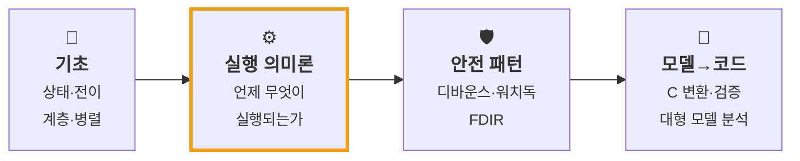

이 블로그는 하나의 목표를 향해 쌓입니다.

> **상태기계(statechart)로 안전한 제어 로직을 설계하고 → C로 구현하고 → 검증한다.**

글을 아무거나 쓰는 게 아니라, 아래 **네 기둥** 안에서 순서대로 채워 갑니다. 각 글은 가능한 한 [예제 코드와 테스트](https://github.com/genie4youu/statechart-examples)로 뒷받침합니다 — 읽고 끝나는 게 아니라 돌려볼 수 있게.

<small>✅ 발행 · 🚧 작성 중 · 📅 예정</small>

---

## 🧱 1. 기초 — 상태기계가 푸는 문제

`if` 문으로는 왜 안 되는지부터, 첫 차트를 만들고 디버깅하기까지.

1. 📅 `if` 문의 한계 — 왜 상태기계인가
2. 📅 첫 차트: state · transition · action · data
3. 📅 로깅으로 버그를 잡다 — 충전량이 100%를 넘었다
4. 📅 계층 상태로 버그를 고치다
5. 📅 플로차트 · 병렬 · 함수 재사용

## ⚙️ 2. 실행 의미론 — 언제 무엇이 실행되는가 ⭐

이 블로그의 **핵심**. 직관과 어긋나는 지점들을 코드로 못 박습니다.

1. ✅ [병렬(AND) 상태는 "동시"에 실행되지 않는다](/posts/stateflow-parallel-and-is-not-simultaneous/)
2. ✅ [{조건 동작}은 천이가 실패해도 이미 실행된 뒤다](/posts/stateflow-condition-action-vs-transition-action/)
3. 📅 `during` 은 상시 실행되지 않는다 — 차트의 생명주기
4. 📅 history junction 을 fault 복구에 쓰면 안 되는 이유

## 🛡️ 3. 안전 설계 패턴

안전이 중요한 시스템에 바로 쓰이는 패턴들.

1. 📅 디바운스 — 노이즈 신호를 안정화하기 (`duration`)
2. 📅 워치독 타임아웃 — `after()` 로 무응답 감지
3. 📅 FDIR — 결함 검출 · 격리 · 복구

## 🔬 4. 모델에서 코드로

설계한 상태기계를 실제로 돌아가는 C로 옮기고, 두 구현이 정말 같은지 검증하기.

1. 📅 상태기계를 C로 — 백투백(back-to-back) 검증
2. 📅 상태 68개짜리 모델을 눈으로 읽을 수 있는가 — API로 해부하기
3. 📅 커버리지 — "무엇을 아직 검증하지 못했나"

---

## 📌 읽는 순서

처음이라면 **1 기초 → 2 실행 의미론 → 3 안전 패턴 → 4 모델→코드** 순서를 권합니다.

다만 이 블로그는 **2 실행 의미론**부터 시작했습니다. 상태기계에서 가장 헷갈리고, 가장 값진 부분이기 때문입니다. 기초가 궁금하면 1번 기둥을 먼저 봐도 좋습니다.

## 💻 코드로 확인하기

글에서 다룬 개념은 [**statechart-examples**](https://github.com/genie4youu/statechart-examples) 저장소에서 **직접 돌려볼 수 있습니다.** 예를 들어 실행 의미론 1편의 "1 스텝 지연"은 [`05-parallel-race`](https://github.com/genie4youu/statechart-examples/tree/main/05-parallel-race) 에서 **테스트가 실제로 측정**합니다.

| 예제 | 기둥 | 글 |
| --- | --- | --- |
| `01-traffic-light` | 🧱 기초 | 📅 |
| `02-elevator` | 🧱 기초 | 📅 |
| `03-debounce` | 🛡️ 안전 패턴 | 📅 |
| `04-watchdog` | 🛡️ 안전 패턴 | 📅 |
| ✅ `05-parallel-race` | ⚙️ 실행 의미론 | [1편](/posts/stateflow-parallel-and-is-not-simultaneous/) |
