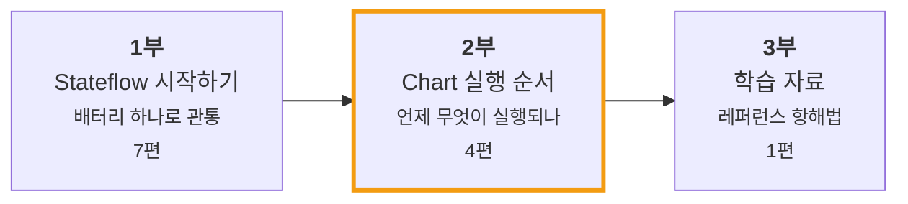

Stateflow와 상태 기계(statechart)를 공부하면서 정리한 글들입니다.

글을 흩어놓지 않고 **세 갈래**로 쌓았습니다. 배터리 예제 하나로 기본기를 관통하고(1부), 거기서 얼버무렸던 **"언제 무엇이 실행되는가"** 를 따로 팠습니다(2부). 3부는 두꺼운 레퍼런스를 다루는 방법입니다.

---

## 1부 · Stateflow 시작하기

**충전식 배터리 하나로 끝까지 갑니다.** 만들고 → 로깅해서 결함을 찾고 → 구조를 바꿔 고치는 과정이 반복됩니다. 매번 `if` 문을 덧대지 않고 **구조**로 풉니다.

| # | 글 | 무엇을 배우나 |
| --- | --- | --- |
| 1 | [배터리 충전 로직을 `if` 문으로 짜다가 포기한 이유](/posts/01-why-state-machine/) | `if` 의 한계 · 상태 기계가 푸는 문제 |
| 2 | [배터리로 만드는 첫 Chart](/posts/02-first-chart/) | State · Transition · `entry`/`during`/`exit` · Chart Data |
| 3 | [로깅을 켜보니 충전량이 100%를 넘고 있었다](/posts/03-log-and-debug/) | Active State 로깅 · SDI · 조건부 Breakpoint |
| 4 | [계층 State로 버그를 고치다](/posts/04-hierarchy/) | Parent / Child · 계층이 절약하는 것 |
| 5 | [Junction으로 경로를 나누다](/posts/05-junction-flowchart/) | Junction · 경로 평가 · Execution Order · Inner Transition |
| 6 | [병렬 State와 Event 브로드캐스트](/posts/06-parallel-and-events/) | Parallel(AND) 분해 · `send()` · Event vs Condition |
| 7 | [Function으로 로직을 재사용하다](/posts/07-reuse-functions/) | Graphical / MATLAB / Simulink Function |

## 2부 · Chart 실행 순서 ⭐

1부에서 Chart를 **그리는 법**을 배웠습니다. 그런데 **그린 것이 어떻게 실행되는지**는 다른 문제입니다.

여기가 직관과 가장 크게 어긋나는 곳이고, 안전이 중요한 시스템에서는 곧 위험이 되는 곳입니다. **같은 그림이 다르게 돌 수 있기 때문입니다.**

| # | 글 | 핵심 |
| --- | --- | --- |
| 1 | [병렬(AND) State는 "동시"에 실행되지 않는다](/posts/stateflow-parallel-and-is-not-simultaneous/) | 동시에 active지만 **순차 실행**. 순서가 결과를 바꾼다 |
| 2 | [Condition Action은 Transition이 실패해도 이미 실행된 뒤다](/posts/stateflow-condition-action-vs-transition-action/) | 경로 검증 **전에** 실행. Backtracking이 되돌려주지 않는다 |
| 3 | [`during` 은 상시 실행되지 않는다](/posts/stateflow-during-and-chart-lifecycle/) | 떠나는 스텝에는 **실행되지 않는다.** Chart 생명주기 |
| 4 | [Super Step — 한 스텝에 Transition이 연쇄한다](/posts/stateflow-super-step/) | 반응 속도를 얻고 **WCET와 무한 루프**를 떠안는다 |

## 3부 · 학습 자료

| # | 글 | 내용 |
| --- | --- | --- |
| 1 | [User's Guide 1,250쪽을 어떻게 항해할 것인가](/posts/navigating-stateflow-users-guide/) | 통독하지 않고 지도를 그리는 법 · MAB 가이드라인 |

---

## 💻 코드로 확인하기

글에서 다룬 개념 중 **코드로 증명할 수 있는 것**은 [**statechart-examples**](https://github.com/genie4youu/statechart-examples) 저장소에 넣었습니다. `make` 한 번으로 빌드되고 테스트가 돌아갑니다.

| 예제 | 짝이 되는 글 | 무엇을 증명하나 |
| --- | --- | --- |
| ✅ [`05-parallel-race`](https://github.com/genie4youu/statechart-examples/tree/main/05-parallel-race) | [2부 1편](/posts/stateflow-parallel-and-is-not-simultaneous/) | 로직이 같고 **두 줄의 순서만 다른** 두 구현에서 **1 스텝 지연**을 측정 |

> 글의 주장을 **테스트가 통과/실패로 증명**하게 하는 것이 목표입니다.
> 읽고 고개를 끄덕이는 것과, 돌려보고 확인하는 것은 다릅니다.

---

## 📖 이 블로그의 용어

Stateflow 편집기 화면에 **영어로 표시되는 것**은 영어로 씁니다. 그 외 일반적인 서술은 한글로 씁니다.

| 구분 | 표기 |
| --- | --- |
| Stateflow 객체·문법 | `State` `Transition` `Junction` `Action` `Event` `Condition` `Data` `Chart` |
| 코드 키워드 | `entry` `during` `exit` `after()` `send()` |
| 일반 서술 | 계층 · 병렬 · 실행 순서 · 조건 · 동작 |

## 🔜 앞으로

- **안전 설계 패턴** — 디바운스 · 워치독 타임아웃 · FDIR
- **모델에서 코드로** — C 변환 · 백투백 검증 · 커버리지
- **대형 모델 해부** — API로 Chart 구조를 표로 추출하기
